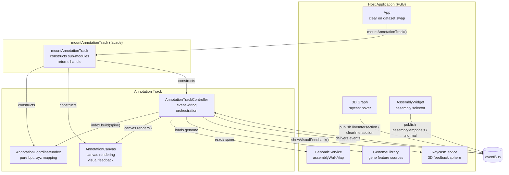
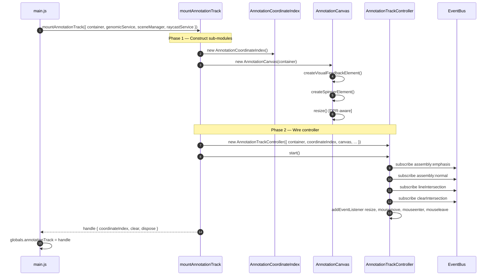
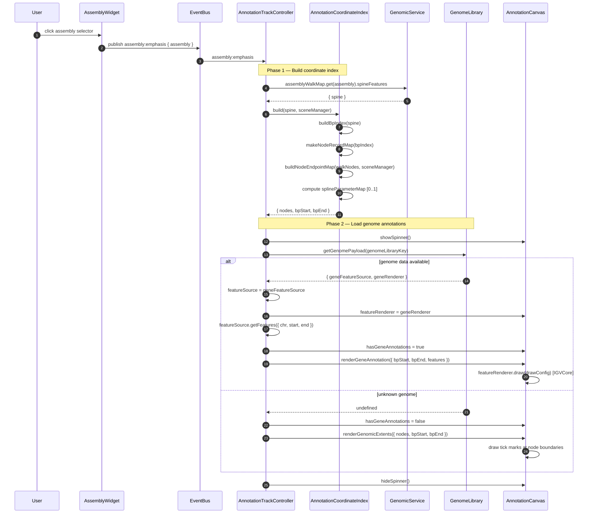
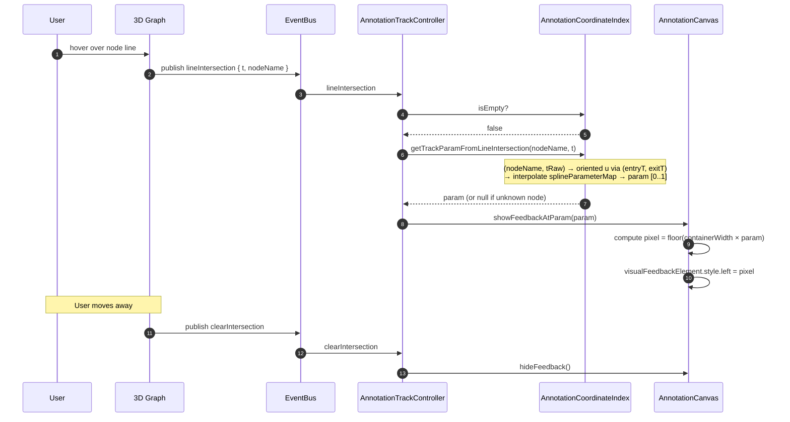
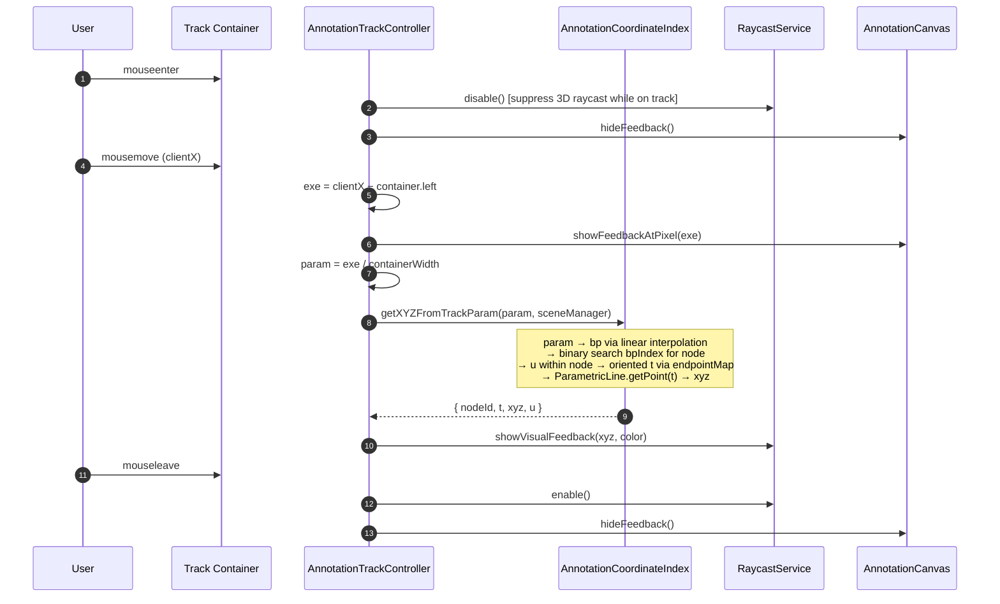
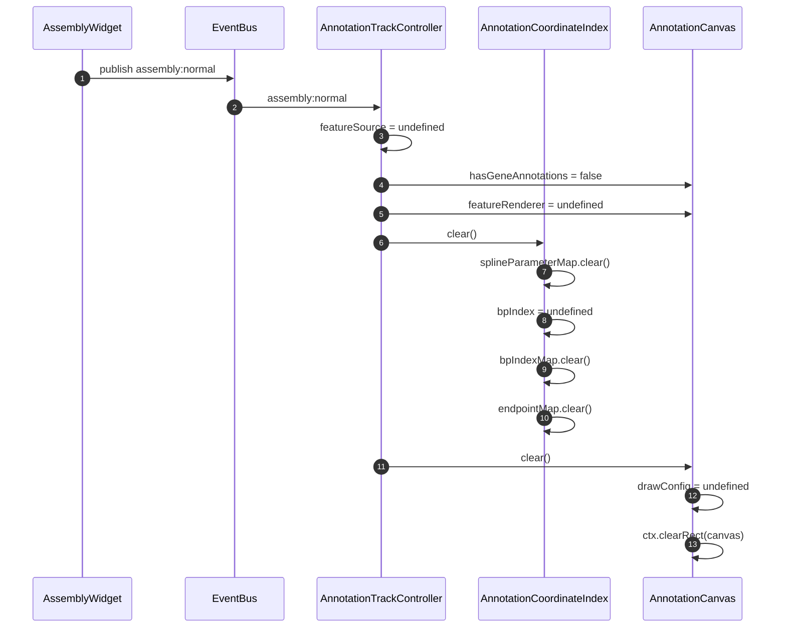
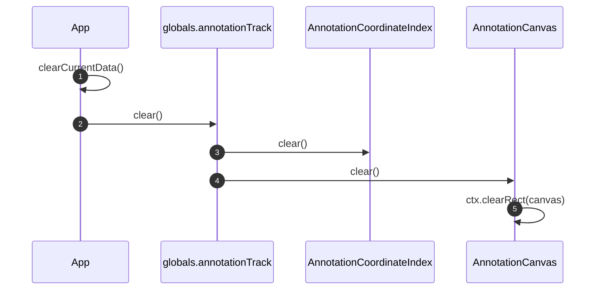
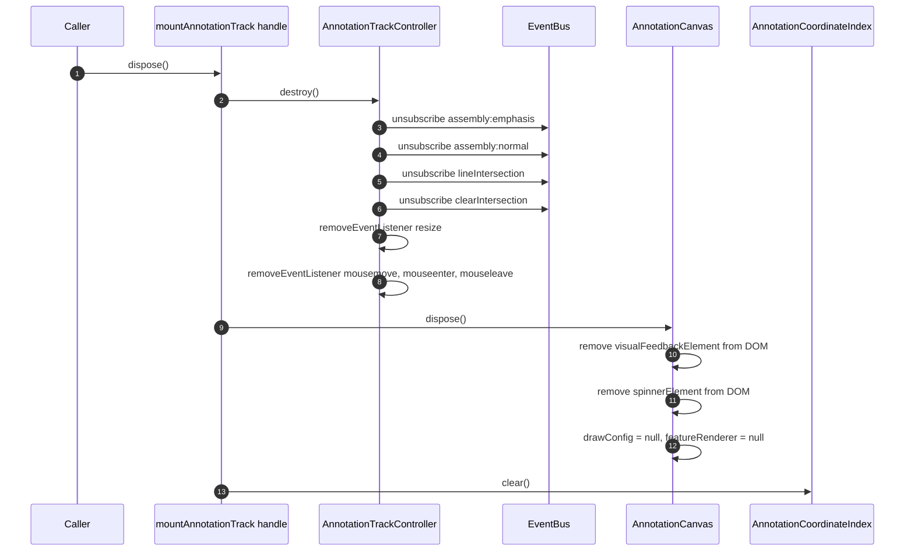
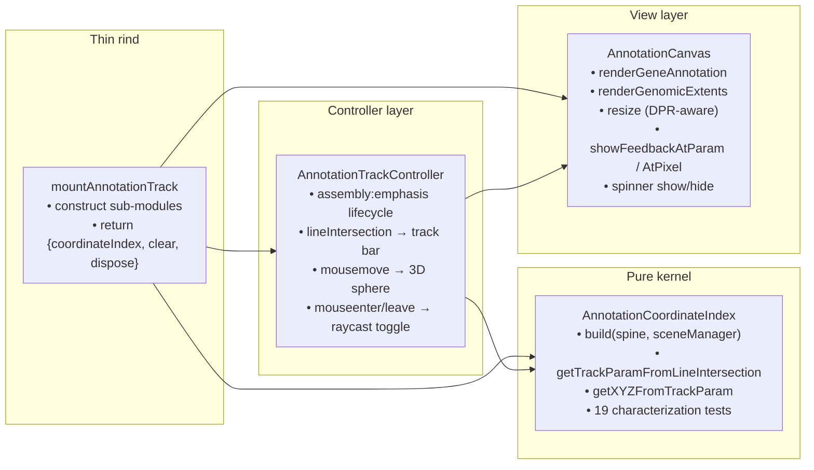

# Annotation Track Interaction Diagrams

Interaction flows for the **annotation track subsystem** after the PR #50 refactor (closes issue #49). The 436-line `AnnotationRenderService` catch-all was split into three collaborators — a pure coordinate index, a canvas renderer, and an event-wiring controller — behind a bootstrap facade.

---

## 1. Architecture Overview

The annotation track is a 2D canvas strip below the 3D graph. When a user selects an assembly, the track loads gene annotations (or falls back to node-boundary tick marks) and shows bidirectional hover feedback: hovering a 3D node positions a vertical bar on the track; hovering the track positions a 3D feedback sphere on the graph.

| Component | Role | Owns |
|-----------|------|------|
| **App** | Orchestrator | Calls `globals.annotationTrack.clear()` on dataset swap |
| **mountAnnotationTrack (facade)** | Bootstrap | Constructs sub-modules, returns `{coordinateIndex, clear, dispose}` |
| **AnnotationCoordinateIndex** | Pure coordinate kernel | bp↔xyz bidirectional mapping; bpIndex, endpointMap, splineParameterMap |
| **AnnotationCanvas** | View | Canvas DPR resize, gene/extent rendering, spinner, visual feedback element |
| **AnnotationTrackController** | Event wiring + orchestration | Event bus subscriptions, DOM mouse handlers, assembly emphasis lifecycle |
| **GenomicService** | Data source | `assemblyWalkMap` (spine features per assembly) |
| **GenomeLibrary** | Data source | Gene annotation feature sources (IGVCore) |
| **RaycastService** | 3D feedback | Visual feedback sphere, enable/disable during track hover |



### Invariants

| Invariant | Where it lives |
|---|---|
| Coordinate math lives in exactly one place | `AnnotationCoordinateIndex`; pinned by 19 characterization tests |
| View knows nothing about events or coordinate math | `AnnotationCanvas` has no `eventBus` import, no coordinate lookups |
| Controller mediates all event→index→canvas flow | `AnnotationTrackController` is the sole subscriber and DOM listener |
| Facade interface is minimal: `{coordinateIndex, clear, dispose}` | `mountAnnotationTrack` |

---

## 2. Bootstrap — Full Sequence

`main.js` constructs the facade during app bootstrap, before any dataset is loaded. The facade builds the coordinate index, canvas, and controller, then starts event subscriptions.



### What lives where after bootstrap

| State | Owner | Initial value |
|---|---|---|
| `bpIndex`, `bpIndexMap`, `endpointMap`, `splineParameterMap` | AnnotationCoordinateIndex | empty (maps cleared) |
| `hasGeneAnnotations`, `featureRenderer`, `drawConfig` | AnnotationCanvas | `false`, `undefined`, `undefined` |
| `assembly`, `featureSource` | AnnotationTrackController | `undefined` |

---

## 3. Assembly Emphasis — Build Index + Load Annotations

When the user clicks an assembly in the widget, the controller receives `assembly:emphasis`, builds the coordinate index, loads genome data, and delegates rendering to the canvas.



### Two rendering modes

| Mode | Trigger | Visual result |
|---|---|---|
| **Gene annotations** | Genome library has data for assembly | Full exon/intron rendering via IGVCore FeatureRenderer |
| **Extent markers** | Unknown genome (library returns `undefined`) | Vertical tick marks at node boundary positions |

---

## 4. 3D Hover → Track Feedback

When the user hovers a node in the 3D graph, the controller maps the raycast parameter to a track position and shows a vertical bar on the canvas.



### Coordinate mapping path (3D → track)

```
raycast t (ParametricLine parameter)
    → oriented u via endpointMap (entryT, exitT)
    → bp via bpIndexMap (bpStart + u × lengthBp)
    → track param via splineParameterMap (startParam..endParam interpolation)
    → pixel via containerWidth × param
```

---

## 5. Track Hover → 3D Feedback

When the user hovers the annotation track canvas, the controller maps the pixel position to a 3D point on the graph and shows a feedback sphere.



### Coordinate mapping path (track → 3D)

```
pixel position on track
    → param = pixel / containerWidth [0..1]
    → bp = bpStart × (1 − param) + bpEnd × param
    → binary search bpIndex → node
    → u = (bp − node.bpStart) / node.lengthBp
    → t = entryT + u × (exitT − entryT) [oriented]
    → ParametricLine.getPoint(t, 'world') → xyz
```

---

## 6. Assembly Normal — Clear State

When the user deselects the assembly, the controller clears all state.



---

## 7. Dataset Swap — Clear via Facade

When a new dataset is loaded, `App.clearCurrentData()` calls the facade's `clear()` method, which resets both the coordinate index and the canvas.



---

## 8. Dispose — Teardown

The facade's `dispose()` tears down the controller (event unsubscriptions + DOM listener removal), the canvas (DOM element cleanup), and the coordinate index (map clearing).



---

## 9. Component Responsibilities



| Module | Imports eventBus? | Imports DOM? | Imports ParametricLine? |
|---|---|---|---|
| `AnnotationCoordinateIndex` | no | no | yes (for 3D point lookups) |
| `AnnotationCanvas` | no | yes | no |
| `AnnotationTrackController` | yes | yes (mouse listeners) | no |
| `mountAnnotationTrack` (facade) | no | no | no |

---

## 10. Events Reference

| Event | Published by | Consumed by | Meaning |
|---|---|---|---|
| `assembly:emphasis` | AssemblyWidget | controller | user selected an assembly; build index + render annotations |
| `assembly:normal` | AssemblyWidget | controller | user deselected assembly; clear all state |
| `lineIntersection` | 3D graph raycast | controller | user hovered a node line; show track position indicator |
| `clearIntersection` | 3D graph raycast | controller | hover ended; hide track position indicator |

---

## 11. Data Flow Summary

```
assembly:emphasis event
        │
        ▼
AnnotationTrackController
        │
        ├── GenomicService.assemblyWalkMap → spine
        │
        ▼
AnnotationCoordinateIndex.build(spine)
        │
        ├── bpIndex (monotonic node→bp mapping)
        ├── endpointMap (oriented entry/exit per node)
        └── splineParameterMap (node→normalized [0..1] track param)
        │
        ▼
GenomeLibrary.getGenomePayload()
        │
        ├── gene data → AnnotationCanvas.renderGeneAnnotation()
        └── no data   → AnnotationCanvas.renderGenomicExtents()


3D hover (lineIntersection)                Track hover (mousemove)
        │                                          │
        ▼                                          ▼
Controller                                 Controller
        │                                          │
        ▼                                          ▼
Index.getTrackParamFromLineIntersection    Index.getXYZFromTrackParam
        │                                          │
        ▼                                          ▼
Canvas.showFeedbackAtParam(param)          RaycastService.showVisualFeedback(xyz)
```

---

## 12. Endpoint Anchoring — Flipped Node Handling

A critical invariant of the coordinate index is **monotonic mapping** even when a node's ParametricLine runs in the opposite direction from the walk order. The `buildNodeEndpointMap` function resolves this by comparing each node's t=0 and t=1 endpoints to its neighbors' centers, then assigning `entryT` (near left neighbor) and `exitT` (near right neighbor).

```
Walk order:     A → B → C
3D positions:   A: [0,1]   B: [2,1] (flipped!)   C: [2,3]

Node B's ParametricLine: t=0 at x=2 (near C), t=1 at x=1 (near A)
    → entryT = 1 (near A), exitT = 0 (near C)
    → oriented u = (tRaw − 1) / (0 − 1) = 1 − tRaw
    → monotonic: as we walk left→right, bp increases smoothly
```

This is pinned by the "flipped-node anchoring" characterization test.

---

## 13. Source Map

| File | Role |
|---|---|
| `src/annotationCoordinateIndex.ts` | Pure coordinate kernel (222 lines) |
| `src/annotationCanvas.ts` | Canvas view (152 lines) |
| `src/annotationTrackController.ts` | Event wiring + orchestration (170 lines) |
| `src/mountAnnotationTrack.ts` | Facade / bootstrap (43 lines) |
| `src/__tests__/annotationCoordinateIndex.test.ts` | 19 characterization tests |

Related: [code-architecture-improvements.md § 4](./code-architecture-improvements.md) · [technical-debt-14-apr-2026.md § #4](./technical-debt-14-apr-2026.md) · PR #50 · closes #49
