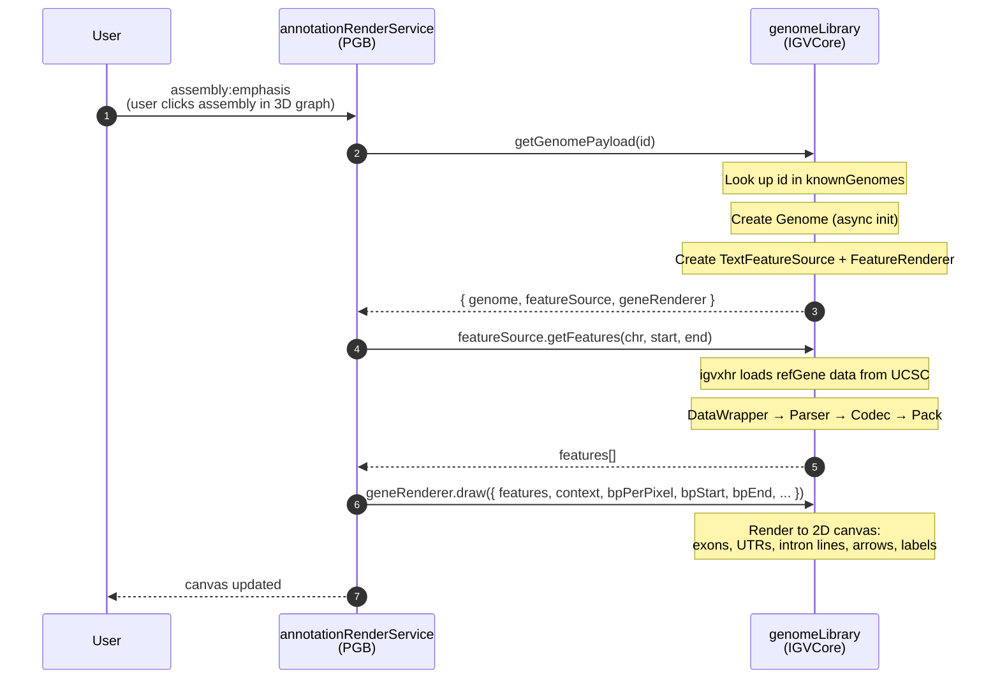
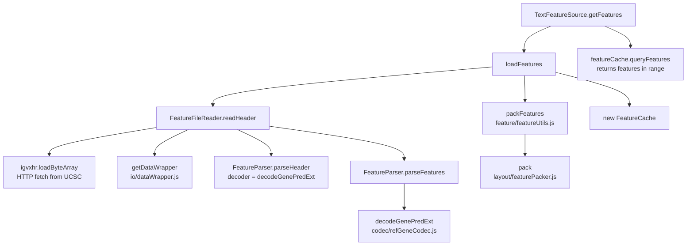
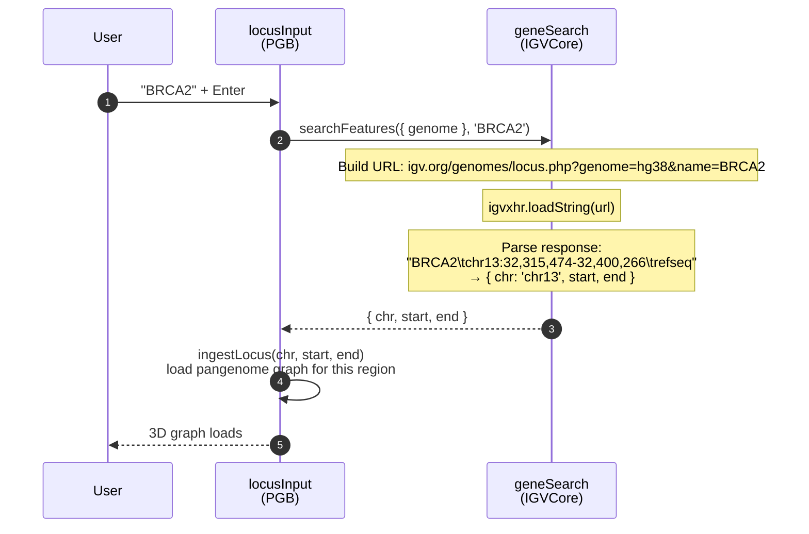
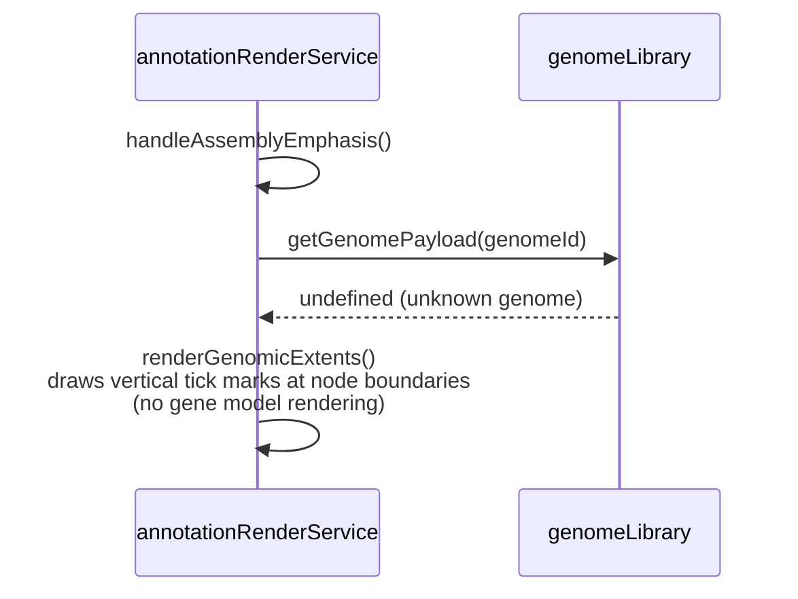

# IGVCore Architecture

IGVCore is a subset of the IGV.js codebase extracted into PGB. It provides two capabilities: loading and rendering gene annotations on a 2D canvas, and resolving gene names to genomic coordinates. PGB interacts with IGVCore through exactly two seams.

## Directory Structure

```
src/IGVCore/
├── genome/           Entry point: genomeLibrary.js
│   ├── genomeLibrary.js    Facade — the only file PGB imports directly
│   ├── genome.js           Genome model (chromosomes, aliases, sequences)
│   ├── knownGenomes.js     Registry of genome configs (hg38, hs1, etc.)
│   └── ...                 Chromosome loading, sequence fetching, cytobands
├── codec/            Pure parsing
│   └── refGeneCodec.js     decodeGenePredExt, findUTRs, decodeExons
├── io/               Data loading
│   ├── textFeatureSource.js   Loads + caches features, delegates to reader
│   ├── featureFileReader.js   Fetches raw data via igvxhr, delegates to parser
│   ├── dataWrapper.js         String/ByteArray line iterator
│   ├── baseFeatureSource.js   Abstract base with next/previous feature
│   ├── chromAliasManager.js   Maps chromosome names between sources
│   ├── binary.js              Binary parser for BigWig/TwoBit formats
│   └── bigwig/                BigBed/BigWig binary readers
├── layout/           Feature packing
│   └── featurePacker.js       Row assignment for overlapping features
├── rendering/        Canvas drawing
│   ├── featureRenderer.js     Draws gene models (exons, UTRs, introns, arrows)
│   ├── featureRendererUtils.js  Coordinate conversion, translation dictionary
│   ├── exonUtils.js           Exon phase/start/end helpers
│   └── igvCanvas.js           Canvas drawing primitives (strokeLine, fillText, etc.)
├── search/           Gene name resolution
│   └── geneSearch.js          Calls IGV web service to resolve names to loci
├── feature/          Parsing glue (2 files remain)
│   ├── featureParser.js       Configures decoder, iterates lines → features
│   └── featureUtils.js        packFeatures (multi-chromosome wrapper)
├── util/             Shared utilities
│   ├── sequenceUtils.js       DNA complement/reverse-complement
│   ├── igvUtils.js            HTTP option building, data URL detection
│   ├── ucscUtils.js           AutoSQL parser (for BigBed schemas)
│   └── colorPalletes.js       Color generation for canvas rendering
└── qtl/
    └── qtlSelections.js       Null object for QTL phenotype selections
```

## Seam 1: Gene Annotations

When a user emphasizes an assembly in the 3D graph, PGB renders gene annotations on a 2D canvas strip below the viewport.



### Data flow detail: loading features

When `textFeatureSource.getFeatures()` is called for the first time, the internal chain is:



### What the renderer draws

`FeatureRenderer.draw()` iterates features and for each one calls `render()`:

- **Single-exon features**: a filled rectangle with directional arrows (strand)
- **Multi-exon features**: a thin center line (intron) with thick rectangles (exons)
  - UTR exons are drawn at half-height
  - Coding exons at full height
  - Partial UTR/coding exons split at cdStart/cdEnd boundaries
  - Directional arrows along intron lines and within wide exons
- **Labels**: gene names centered below features (when zoom permits)
- **Amino acid rendering**: at very high zoom (< 0.25 bp/pixel), codons are translated and drawn over coding exons

## Seam 2: Gene Search

When a user types a gene name in the locus input, PGB resolves it to genomic coordinates via the IGV web service.



### Unknown genome fallback

When an assembly's genome ID is not in `knownGenomes` (e.g., a non-human reference), `getGenomePayload()` returns `undefined`. In this case, `annotationRenderService` falls back to rendering simple genomic extent markers (vertical tick marks at node boundaries) instead of gene annotations. This is the `hasGeneAnnotations = false` path.



## What changed in the refactoring

The original IGVCore directory was a flat copy of IGV.js internals. The refactoring reorganized ~50 files into modules that reflect PGB's actual usage:

| Before | After | What changed |
|--------|-------|-------------|
| `feature/decode/ucsc.js` (661 lines, 13 decoders) | `codec/refGeneCodec.js` (~100 lines, 1 decoder) | 12 unused decoders deleted |
| `feature/` (14 files mixing I/O, parsing, rendering) | Split across `io/`, `rendering/`, `codec/`, `layout/` | Each module has a single concern |
| `feature/gff/` (4 files) | Deleted | Dead code — GFF parsing unreachable from PGB |
| `bigwig/` at top level | `io/bigwig/` | Binary I/O grouped with other I/O |
| `binary.js` at top level | `io/binary.js` | Same |
| `igv-canvas.js` at top level | `rendering/igvCanvas.js` | Grouped with rendering |
| `search.js` at top level | `search/geneSearch.js` | Own module |
| No tests | 83 characterization tests | Feathers-style safety net for future changes |

The two external entry points remain unchanged:
- `src/main.js` → `import GenomeLibrary from "./igvCore/genome/genomeLibrary.js"`
- `src/locusInput.js` → `import {searchFeatures} from "./igvCore/search/geneSearch.js"`
