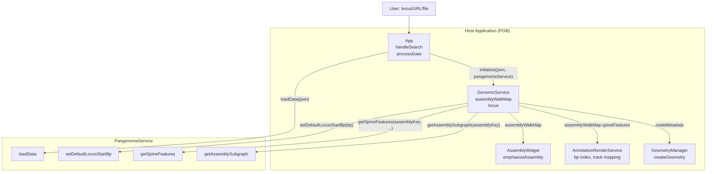
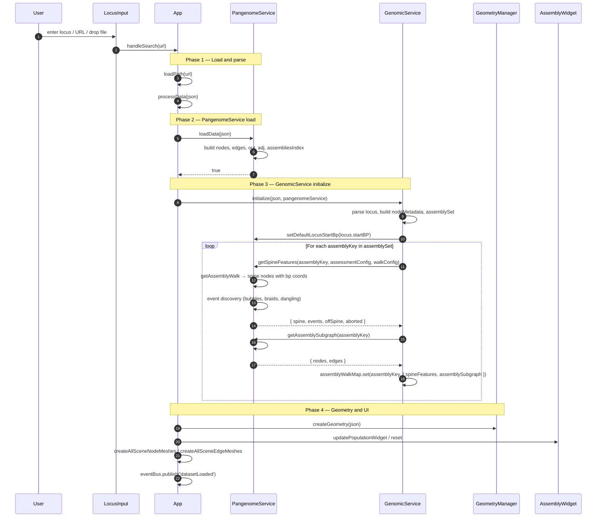
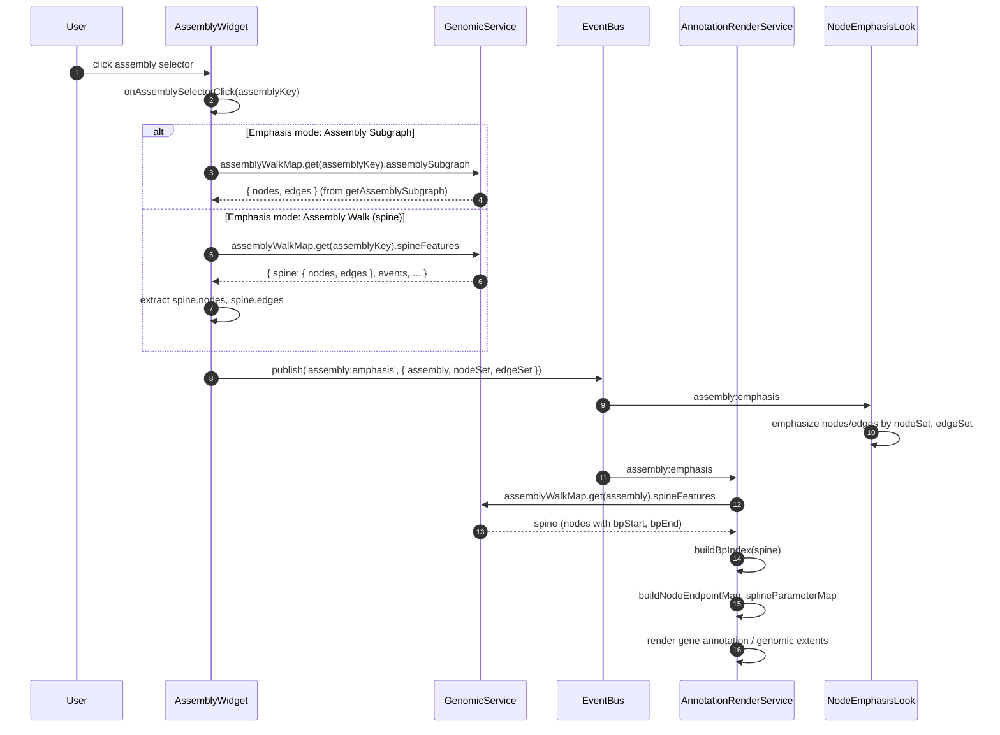
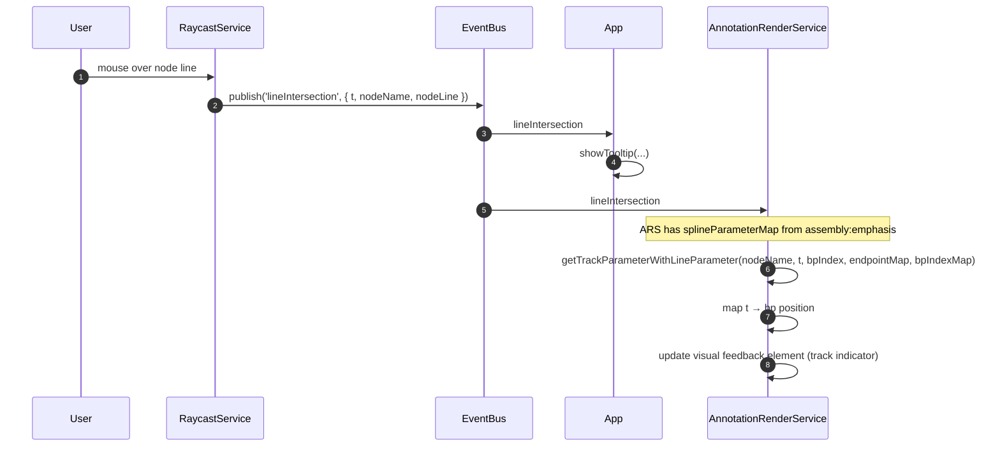
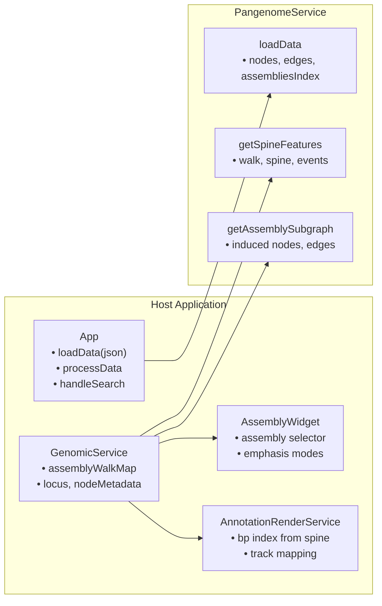

# PGB ↔ PangenomeService Interaction Diagrams

Interaction flows for how **PangenomeService** is used in the PGB (Pan Genome Browser) application. PangenomeService loads pangenome graph data, computes assembly walks, spine features, and subgraphs — all consumed by GenomicService and downstream components for visualization and annotation.

---

## 1. Architecture Overview

PangenomeService is the **graph computation engine**. The host application loads JSON, passes it to PangenomeService, and uses the resulting spine features and subgraphs for 3D rendering, assembly emphasis, and annotation tracks.

| Component | Role | Owns |
|-----------|------|------|
| **App** | Orchestrator | Loads JSON, calls `loadData`, triggers `genomicService.initialize` |
| **PangenomeService** | Graph engine | Nodes, edges, walks, spine features, assembly subgraphs |
| **GenomicService** | Consumer | `assemblyWalkMap` (spine + subgraph per assembly), locus, node metadata |
| **AssemblyWidget** | UI | Assembly selector; uses `assemblyWalkMap` for emphasis |
| **AnnotationRenderService** | Rendering | Uses `assemblyWalkMap.spineFeatures` for bp index and track mapping |
| **GeometryManager** | 3D geometry | Uses `genomicService.nodeMetadata` (derived from JSON, not PangenomeService) |



---

## 2. Data Load — Full Sequence

When the user enters a locus, URL, or drops a JSON file, the full pipeline runs. PangenomeService is invoked during `processData`.

**Entry points:** (1) LocusInput (locus string, URL, or local file path) → `app.handleSearch(url)`; (2) Drag-and-drop of JSON file → container drop handler → `app.processData(json)` directly.



### Key Points

| Aspect | Detail |
|--------|--------|
| **Single loadData call** | App calls `pangenomeService.loadData(json)` once per dataset |
| **Per-assembly iteration** | GenomicService loops over `assemblySet` and calls `getSpineFeatures` + `getAssemblySubgraph` for each |
| **Cached in assemblyWalkMap** | Results are stored in `genomicService.assemblyWalkMap`; downstream components read from there |
| **No direct PangenomeService after init** | AssemblyWidget and AnnotationRenderService use `genomicService.assemblyWalkMap`, not PangenomeService directly |

---

## 3. Assembly Emphasis — User Clicks Assembly Selector

When the user clicks an assembly in the Assembly Widget, the app emphasizes nodes/edges. Data comes from `assemblyWalkMap`, which was populated by PangenomeService during init.



### Data Source by Mode

| Mode | Source | PangenomeService method |
|------|--------|-------------------------|
| **Assembly Subgraph** | `assemblyWalkMap.get(key).assemblySubgraph` | `getAssemblySubgraph(assemblyKey)` |
| **Assembly Walk** | `assemblyWalkMap.get(key).spineFeatures.spine` | `getSpineFeatures(...).spine` |

---

## 4. Annotation Track — Line Intersection (Hover)

When the user hovers over a node line, the annotation track shows a vertical indicator at the corresponding base-pair position. The bp mapping relies on spine data from PangenomeService (via GenomicService).



### Spine Data Flow for Annotations

```
PangenomeService.getSpineFeatures()
    → spine.nodes: [{ id, bpStart, bpEnd, lengthBp }, ...]
    → GenomicService.assemblyWalkMap
    → AnnotationRenderService.buildBpIndex(spine)
    → bpIndex, bpIndexMap, endpointMap
    → getTrackParameterWithLineParameter(t, ...) → bp
```

---

## 5. Component Responsibilities



| Component | Lives in | PangenomeService usage |
|-----------|----------|------------------------|
| **App** | app.js | `loadData(json)`; passes pangenomeService to genomicService.initialize |
| **GenomicService** | genomicService.js | `setDefaultLocusStartBp`, `getSpineFeatures`, `getAssemblySubgraph`; caches in assemblyWalkMap |
| **AssemblyWidget** | widgets/assemblyWidget.js | Reads `assemblyWalkMap` (no direct PangenomeService calls) |
| **AnnotationRenderService** | annotationRenderService.js | Reads `assemblyWalkMap.spineFeatures` for spine (no direct PangenomeService calls) |
| **GeometryManager** | geometryManager.js | Uses genomicService.nodeMetadata (from JSON); no PangenomeService |

---

## 6. PangenomeService API Used by Host

| Method | Caller | When |
|--------|--------|------|
| `loadData(json)` | App | Once per dataset load (processData) |
| `setDefaultLocusStartBp(bp)` | GenomicService | During initialize, after parsing locus |
| `getSpineFeatures(assemblyKey, assessOpts, walkOpts)` | GenomicService | Once per assembly during initialize |
| `getAssemblySubgraph(assemblyKey)` | GenomicService | Once per assembly during initialize |

### Methods Not Used by Host

| Method | Purpose |
|--------|---------|
| `listAssemblyKeys()` | Returns assembly keys; host derives assemblySet from JSON node metadata instead |
| `getAssemblyWalk()` | Used internally by `getSpineFeatures`; host does not call directly |
| `getDefaultLocusStartBp()` | Getter; host does not read back |
| `getAssemblySubgraph(..., { includeAdj, includeDirectedAdj })` | Host uses default options only |

---

## 7. Data Flow Summary

```
JSON (node, edge, sequence, locus)
        │
        ▼
PangenomeService.loadData(json)
        │
        ├── nodes Map, edges Map, out, adj, assembliesIndex
        │
        ▼
GenomicService.initialize(json, pangenomeService)
        │
        ├── setDefaultLocusStartBp(locus.startBP)
        │
        ├── for each assemblyKey:
        │       getSpineFeatures(assemblyKey, ...)
        │           ├── getAssemblyWalk() → path
        │           ├── spine nodes with bpStart, bpEnd
        │           └── events (bubbles, braids, dangling)
        │       getAssemblySubgraph(assemblyKey)
        │           └── induced { nodes, edges }
        │       assemblyWalkMap.set(assemblyKey, { spineFeatures, assemblySubgraph })
        │
        ▼
assemblyWalkMap
        │
        ├── AssemblyWidget.emphasizeAssembly()
        │       ├── spineFeatures.spine (Assembly Walk mode)
        │       └── assemblySubgraph (Assembly Subgraph mode)
        │
        └── AnnotationRenderService.handleAssemblyEmphasis()
                └── spineFeatures.spine → buildBpIndex, splineParameterMap
```

---

## 8. Lifecycle — Clear on New Load

When a new dataset is loaded, `clearCurrentData` runs before `processData`. GenomicService clears its maps (including assemblyWalkMap). PangenomeService is not explicitly cleared; `loadData` overwrites its internal graph.

```mermaid
%%{init: {'themeVariables': {'fontSize': '16px'}}}%%
sequenceDiagram
    autonumber
    participant APP as App
    participant GS as GenomicService
    participant PS as PangenomeService

    APP->>APP: clearCurrentData()
    APP->>GS: clear()
    GS->>GS: assemblyWalkMap.clear()
    GS->>GS: assemblySet.clear()
    GS->>GS: nodeMetadata.clear()

    APP->>APP: loadPath(url) → json
    APP->>APP: processData(json)
    APP->>PS: loadData(json)
    Note right of PS: Overwrites graph; no explicit clear
    APP->>GS: initialize(json, pangenomeService)
```
