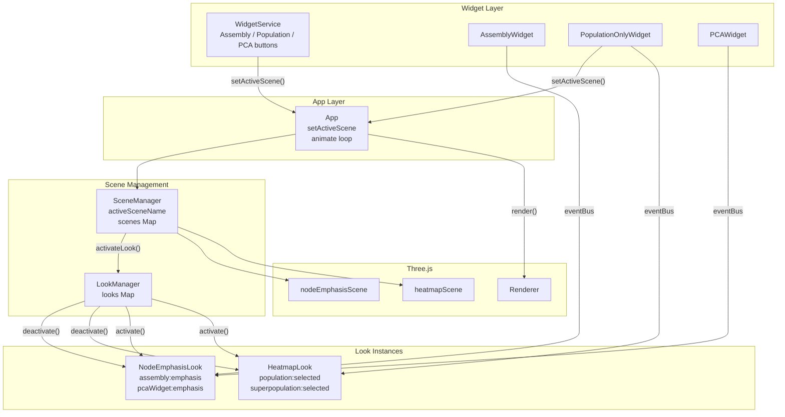
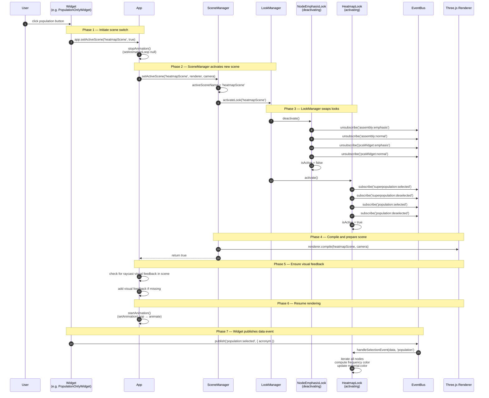
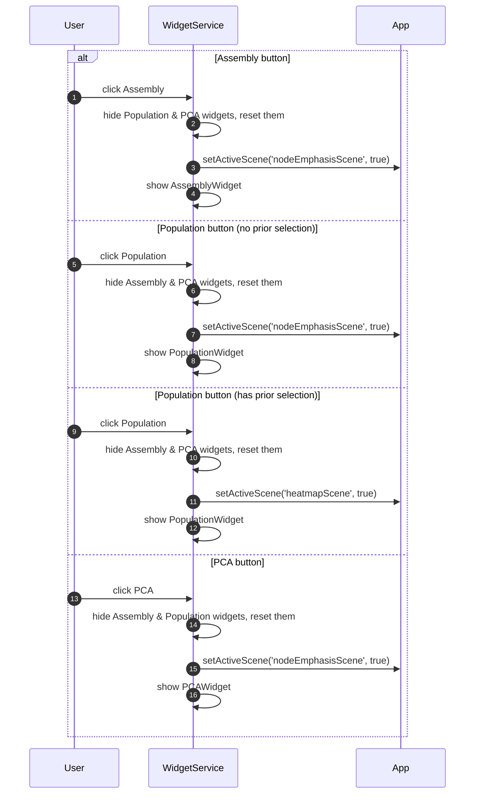
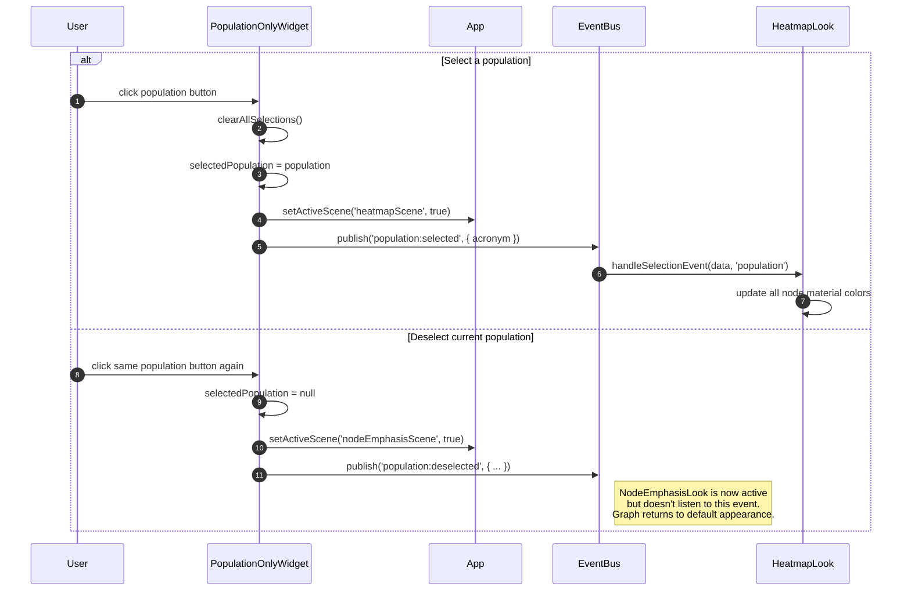
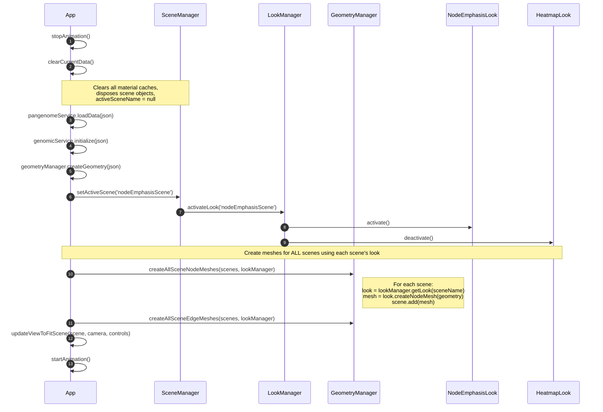

# Look/Scene Switch Interaction Diagram

Interaction flows for switching between scene/look combinations in PGB.

---

## 1. Architecture Overview

Two scenes, two looks, one active at a time:

| Scene | Look | Activated By |
|-------|------|-------------|
| **nodeEmphasisScene** | NodeEmphasisLook | Assembly widget, PCA widget, population deselection, data load |
| **heatmapScene** | HeatmapLook | Population/superpopulation selection |

---

## 2. Scene Switch — Full Sequence

When the user triggers a scene switch (e.g., clicking a population button to go from nodeEmphasisScene to heatmapScene):

### Key Points

| Aspect | Detail |
|--------|--------|
| **Animation pause** | The render loop is stopped before the switch and restarted after, preventing partial-state rendering |
| **Deactivate before activate** | `LookManager.activateLook()` deactivates ALL other looks first, then activates the target |
| **Event isolation** | After the switch, only the new look's event subscriptions are live. Events for the old look's concerns are ignored |
| **Scene compilation** | `renderer.compile()` is called to pre-compile shaders, avoiding first-frame stutter |
| **Event follows switch** | The widget publishes its data event AFTER `setActiveScene()`, ensuring the new look is ready to receive it |

---

## 3. Widget Button Click — Scene Selection Logic

The WidgetService determines which scene to activate based on context:

### Scene Selection Rules

| Widget Button | Condition | Scene |
|---------------|-----------|-------|
| Assembly | Always | `nodeEmphasisScene` |
| Population | No active selection | `nodeEmphasisScene` |
| Population | Has active superpopulation or population | `heatmapScene` |
| PCA | Always | `nodeEmphasisScene` |

---

## 4. Population Selection/Deselection — Scene Toggling

Within the PopulationOnlyWidget, selecting and deselecting populations toggles between scenes:

---

## 5. Data Load — Initial Scene Setup

When new data is loaded, the system always starts with `nodeEmphasisScene`:

### Key Point

Meshes are created for **all** scenes at data load time, not on-demand. Each scene gets its own set of node and edge meshes, created using that scene's Look (which determines materials and colors). This is why switching scenes is fast — both scenes are pre-populated.

---

## 6. Component Responsibilities

| Component | Responsibility |
|-----------|---------------|
| **WidgetService** | Button UI, determines which scene to activate, shows/hides widget panels |
| **PopulationOnlyWidget** | Population list UI, publishes selection events, calls `setActiveScene()` directly |
| **AssemblyWidget** | Assembly list UI, publishes emphasis events (does not switch scenes) |
| **PCAWidget** | PCA coordinate list UI, publishes emphasis events (does not switch scenes) |
| **App** | Owns renderer and animation loop, `setActiveScene()` pauses/resumes animation |
| **SceneManager** | Manages scene map, delegates to LookManager, compiles scenes |
| **LookManager** | Activates/deactivates looks, enforces one-active-at-a-time |
| **Look subclasses** | Subscribe to events, manage materials, define visual behavior |
