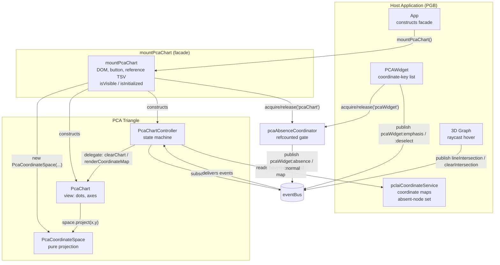
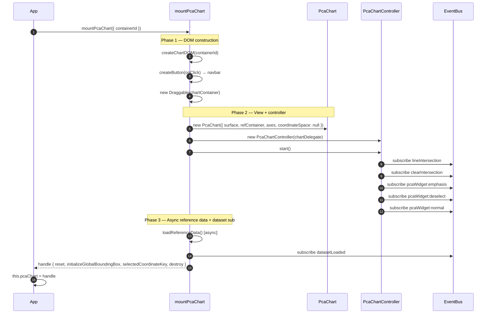
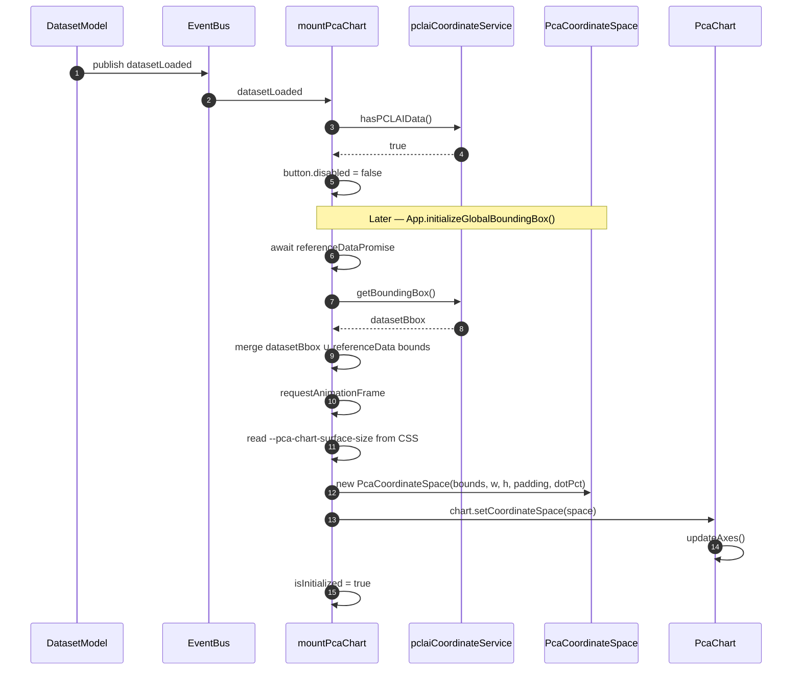
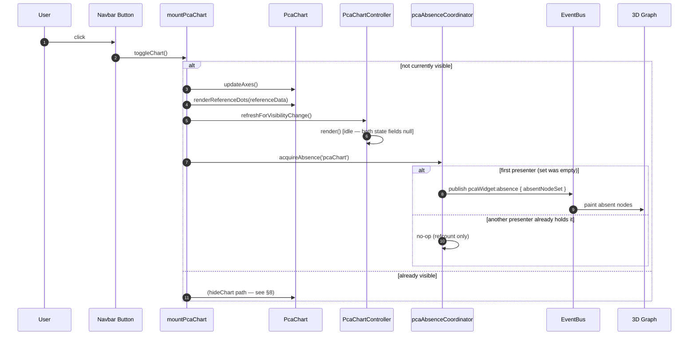
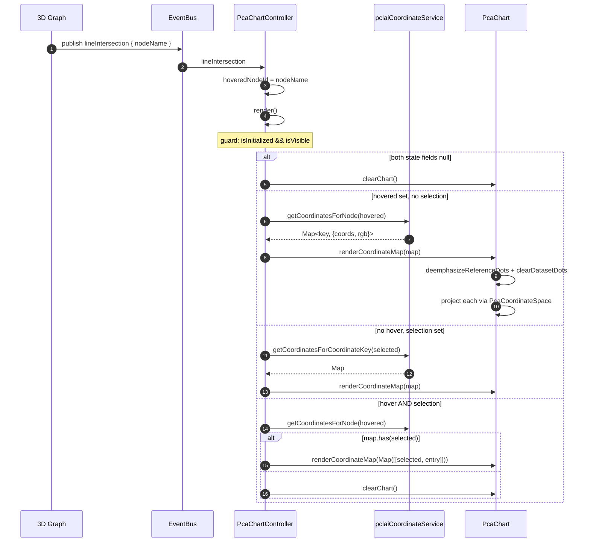
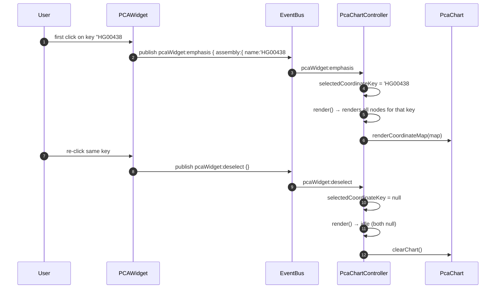
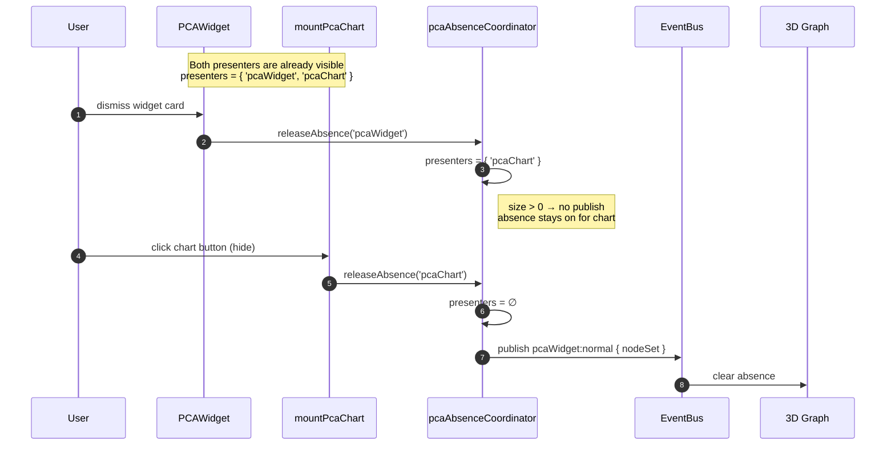
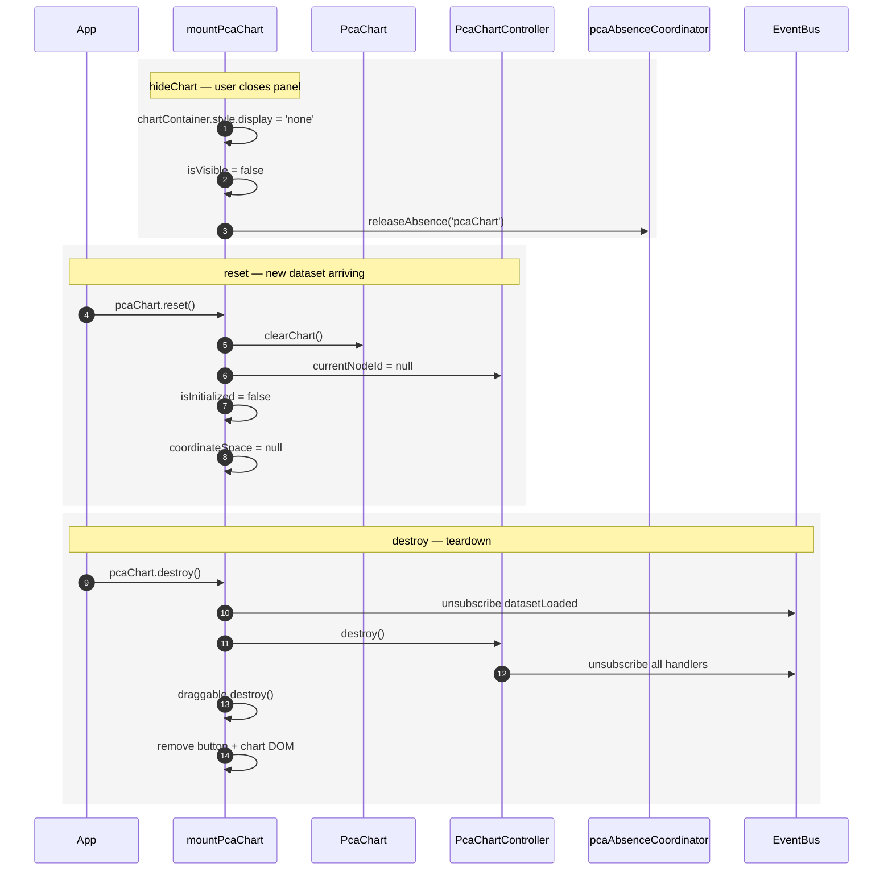
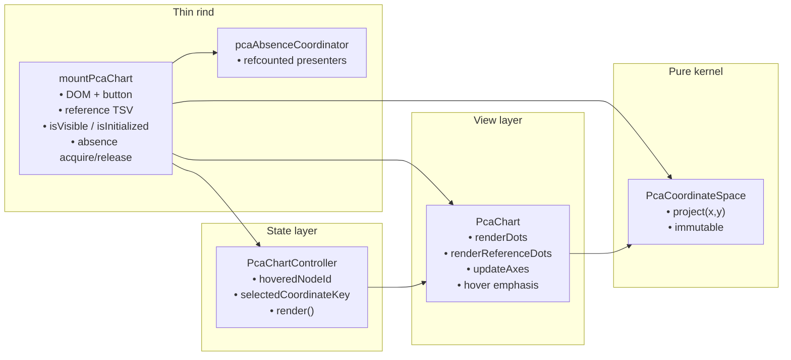

# PCA Triangle Interaction Diagrams

Interaction flows for the **PCA chart subsystem** after the PR #48 refactor (closes issues #46, #47). The 970-line `pcaChartService` singleton was split into four small collaborators plus a refcount coordinator: a pure projection kernel, a view, a state-machine controller, and a bootstrap facade.

---

## 1. Architecture Overview

The PCA chart shows dataset PCLAI coordinates as dots on a 2D scatter plot with a reference-data background. It reacts to two independent signals — 3D-node hover (`lineIntersection`) and PCA-widget coordinate-key selection (`pcaWidget:emphasis`) — and renders as a pure function of `{ hoveredNodeId, selectedCoordinateKey }`.

| Component | Role | Owns |
|-----------|------|------|
| **App** | Orchestrator | Constructs facade once in its constructor; stores handle as `this.pcaChart` |
| **mountPcaChart (facade)** | Bootstrap | Card DOM, navbar button, reference-TSV fetch, `isVisible`/`isInitialized`, absence acquire/release |
| **PcaCoordinateSpace** | Pure projection kernel | `project(x, y) → { left, top, size }`; immutable; no DOM/events |
| **PcaChart** | View | Surface, axes, dataset dots, reference dots, hover emphasis, desaturation |
| **PcaChartController** | State machine | `{ hoveredNodeId, selectedCoordinateKey }`; event subscriptions; single `render()` path |
| **pcaAbsenceCoordinator** | Gatekeeper | Refcounted presenter set; sole publisher of `pcaWidget:absence` / `pcaWidget:normal` |
| **PCAWidget** | Sibling presenter | Coordinate-key list card; publishes `pcaWidget:emphasis` / `:deselect`; also acquires absence |
| **pclaiCoordinateService** | Data source | Coordinate maps, bounding box, absent-node set |



### Invariants

| Invariant | Where it lives |
|---|---|
| Projection math lives in exactly one place | `PcaCoordinateSpace`; pinned by 8 characterization tests |
| View knows nothing about events or dataset | `PcaChart` has no `eventBus` import |
| Rendered chart is a pure function of `(hoveredNodeId, selectedCoordinateKey)` | `PcaChartController.render()` |
| `pcaWidget:absence` / `:normal` has exactly one publisher | `pcaAbsenceCoordinator` |

---

## 2. Bootstrap — Full Sequence

`App` constructs the facade exactly once in its constructor. The facade builds DOM, wires up the view and controller, starts the reference-TSV fetch, and subscribes to `datasetLoaded` — all before any dataset has arrived.



### What lives where after bootstrap

| State | Owner | Initial value |
|---|---|---|
| `isVisible` | facade closure | `false` |
| `isInitialized` | facade closure | `false` |
| `coordinateSpace` | facade closure | `null` |
| `referenceData` | facade closure | `[]` (filled by async fetch) |
| `hoveredNodeId` | controller | `null` |
| `selectedCoordinateKey` | controller | `null` |

---

## 3. Dataset Load — Coordinate Space Construction

When a dataset loads, the facade enables the navbar button. Separately, `App.initializeGlobalBoundingBox()` awaits the reference-TSV fetch, merges dataset and reference bounds, reads the surface size from CSS, and constructs the `PcaCoordinateSpace`. Until this point, hover and widget events fire into a controller whose `isInitialized()` guard short-circuits `render()`.



### Why a two-step init

| Step | Blocked on | Reason it can't happen sooner |
|---|---|---|
| Button enable | `datasetLoaded` | Needs PCLAI presence check |
| Coordinate space | reference TSV + rAF + CSS read | Bounds must union reference data; surface size is CSS-driven |

---

## 4. Show Chart — Acquire Absence

Clicking the PCA Chart button toggles visibility. Showing the chart acquires the absence presenter slot — the first presenter to do so triggers `pcaWidget:absence`, which tells the 3D graph to paint PCLAI-absent nodes in "absence" color.



---

## 5. Hover a 3D Node — Controller State Machine

The controller subscribes to `lineIntersection` and `clearIntersection`. Every handler follows the same contract: mutate `{ hoveredNodeId, selectedCoordinateKey }`, then call `render()`. The render path is a single switch on the two state fields.



### The four render branches

| `hoveredNodeId` | `selectedCoordinateKey` | Result |
|---|---|---|
| `null` | `null` | idle — reference dots at full color, no dataset dots |
| set | `null` | all PCLAI keys for that node |
| `null` | set | all nodes that carry that key |
| set | set | single dot for (node, key) if present, else idle |

---

## 6. Widget Re-click — The #47 Fix

Issue #47 was that re-clicking the already-selected coordinate key in the widget should toggle the chart back to idle, but the old service had no channel to learn about the toggle-off. PR #48 added a `pcaWidget:deselect` event; the controller subscribes to it and clears `selectedCoordinateKey`, which falls through the pure `render()` path to idle. Once the state machine existed, the fix was two lines.



---

## 7. Refcounted Absence — Dismiss One Presenter

Both the PCA widget card and the PCA chart panel want the 3D graph in absence mode while they're visible. Without coordination, dismissing the widget would publish `pcaWidget:normal` and wipe absence state the chart still needs. The coordinator refcounts presenters by ID and only publishes `:normal` when the last presenter releases.



### Coordinator contract

| Rule | Behavior |
|---|---|
| First `acquire()` (set was empty) | Publish `pcaWidget:absence` |
| Re-entrant `acquire()` from same ID | No-op |
| `release()` from unknown ID | No-op |
| Last `release()` (set becomes empty) | Publish `pcaWidget:normal` |

---

## 8. Hide / Reset / Destroy — Lifecycle

The facade owns lifecycle transitions. `reset()` is called on new-dataset load; `destroy()` on teardown. The controller and draggable clean up their subscriptions and DOM listeners.



---

## 9. Component Responsibilities



| Module | Imports eventBus? | Imports DOM? | Imports dataset model? |
|---|---|---|---|
| `PcaCoordinateSpace` | no | no | no |
| `PcaChart` | no | yes | no |
| `PcaChartController` | yes | no | yes (pclaiCoordinateService) |
| `mountPcaChart` (facade) | yes | yes | yes |
| `pcaAbsenceCoordinator` | yes | no | yes |

---

## 10. Events Reference

| Event | Published by | Consumed by | Meaning |
|---|---|---|---|
| `datasetLoaded` | DatasetModel | facade | new dataset available; update button state |
| `lineIntersection` | 3D graph raycast | controller | user hovered a node line |
| `clearIntersection` | 3D graph raycast | controller | hover ended |
| `pcaWidget:emphasis` | PCAWidget | controller | user selected a coordinate key |
| `pcaWidget:deselect` | PCAWidget | controller | user re-clicked the selected key (#47 fix) |
| `pcaWidget:absence` | `pcaAbsenceCoordinator` | 3D graph Look | paint absent nodes |
| `pcaWidget:normal` | `pcaAbsenceCoordinator` | 3D graph Look | clear absence |

---

## 11. Data Flow Summary

```
user hover / widget click / dataset load
        │
        ▼
eventBus
        │
        ▼
PcaChartController
        │ (mutate state)
        ├── hoveredNodeId
        └── selectedCoordinateKey
        │
        ▼
render() — pure function of (hovered, selected)
        │
        ├── idle       → PcaChart.clearChart()
        ├── hover only → pclai.getCoordinatesForNode(h)
        ├── sel only   → pclai.getCoordinatesForCoordinateKey(s)
        └── both       → filter(h, s)
        │
        ▼
PcaChart.renderDots(map) / clearChart()
        │
        ▼
PcaCoordinateSpace.project(x, y) → { left, top, size }
        │
        ▼
DOM dots in chartSurface
```

---

## 12. Source Map

| File | Role |
|---|---|
| `src/widgets/pcaCoordinateSpace.js` | Pure projection kernel |
| `src/widgets/pcaChart.js` | View |
| `src/widgets/pcaChartController.js` | State machine |
| `src/widgets/mountPcaChart.js` | Facade / bootstrap |
| `src/widgets/pcaAbsenceCoordinator.js` | Refcount gate |
| `src/widgets/pcaWidget.ts` | Sibling presenter (not part of the triangle, but a collaborator) |
| `src/__tests__/pcaCoordinateSpace.test.js` | 8 characterization tests pinning the projection spec |

Related: [code-architecture-improvements.md § 6](./code-architecture-improvements.md) · PR #48 · closes #46, #47
