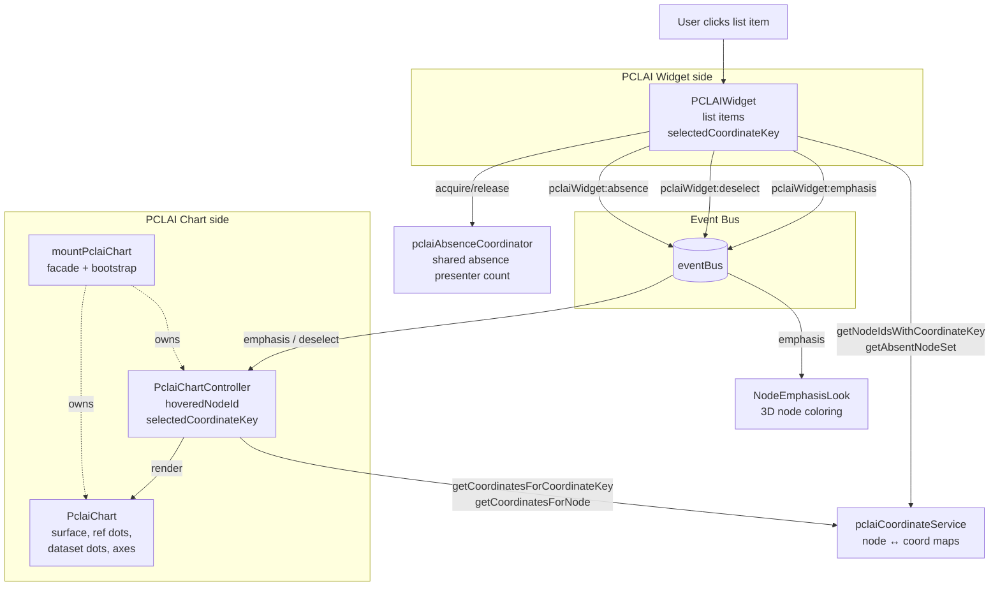
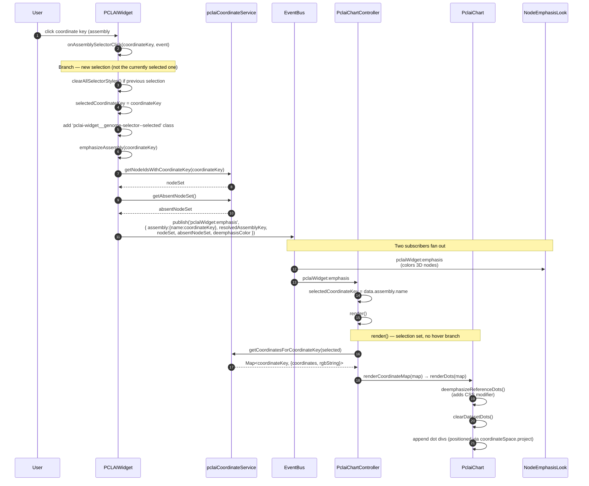
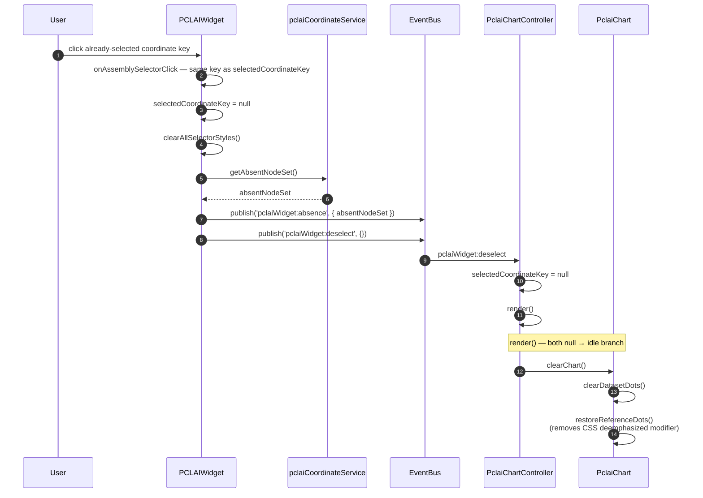
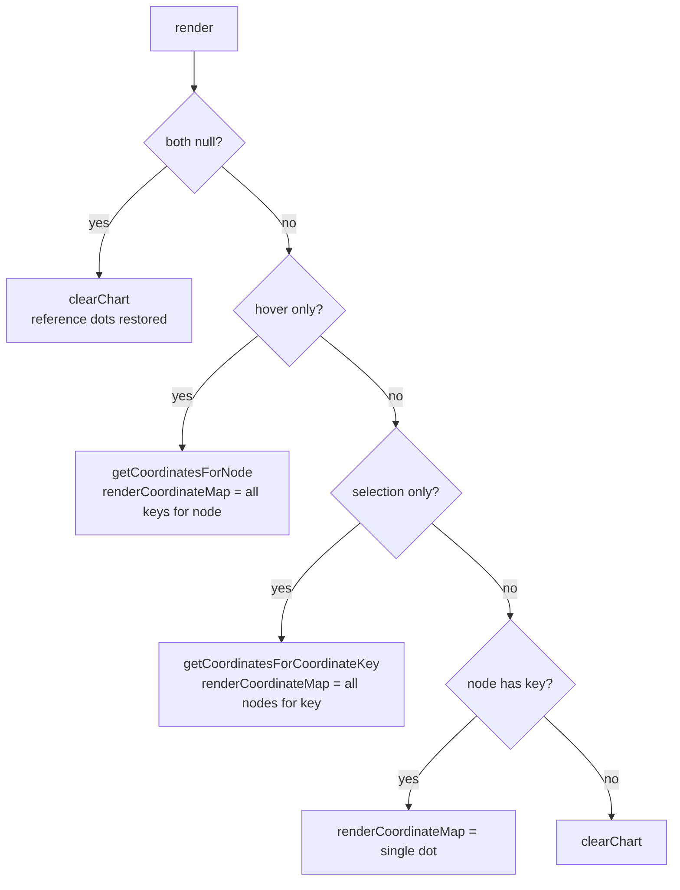
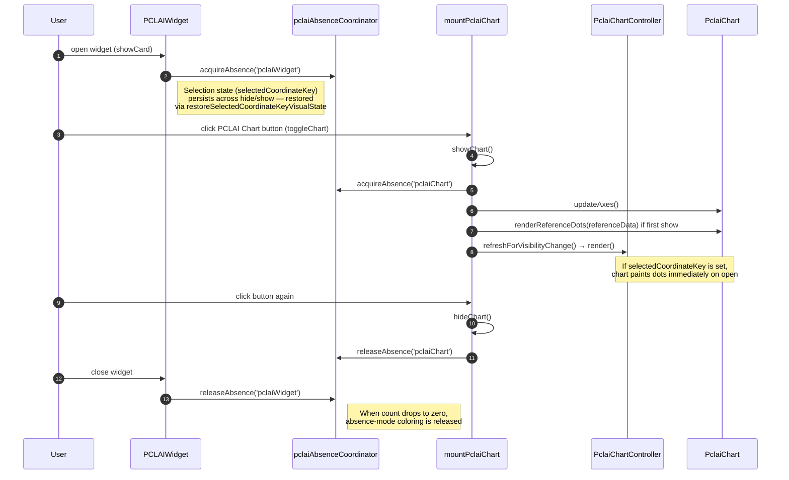

# PCLAI Widget ↔ PCLAI Chart Interaction Diagrams

Interaction flows between the **PCLAI Widget** (scrollable list of `assembly#haplotype` coordinate keys) and the **PCLAI Chart** (2D scatter plot with reference background) when the user selects an item in the widget.

The two components are decoupled — they communicate exclusively through `eventBus`. The widget never holds a reference to the chart, and the chart never queries the widget. State convergence happens via three events: `pclaiWidget:emphasis`, `pclaiWidget:deselect`, and `pclaiWidget:absence`.

---

## 1. Architecture Overview

The widget owns the list UI and the user's current selection. The chart owns the surface (background image, reference dots, axes, dataset dots) and renders as a pure function of `(hoveredNodeId, selectedCoordinateKey)` — both inputs arrive over the event bus.

| Component | Role | Owns |
|-----------|------|------|
| **PCLAIWidget** | List UI + selection source | `selectedCoordinateKey`, list items, selection-toggle behavior |
| **eventBus** | Decoupling layer | Pub/sub between widget and chart |
| **PclaiChartController** | Chart state machine | `hoveredNodeId`, `selectedCoordinateKey`; calls `render()` on every event |
| **PclaiChart** | View | Surface, reference dots, dataset dots, axes; `renderDots`, `clearChart`, `exportToSvg` |
| **mountPclaiChart** | Bootstrap facade | Wires controller↔chart, owns reference data, card chrome, button |
| **pclaiCoordinateService** | Data source (singleton) | Coordinate maps keyed by node id and by coordinate key |
| **pclaiAbsenceCoordinator** | Shared absence-mode arbiter | Counts presenters (`pclaiWidget`, `pclaiChart`) requesting "absent" emphasis |



---

## 2. Selection — User Clicks a Coordinate Key in the Widget

The most common path. Widget toggles selection state, fires `pclaiWidget:emphasis`, controller updates its state and calls `render()`, chart paints dataset dots over the (deemphasized) reference layer.



### Event Payload — `pclaiWidget:emphasis`

| Field | Type | Notes |
|-------|------|-------|
| `assembly.name` | string | The coordinate key (`assembly#haplotype`) — controller reads this |
| `resolvedAssemblyKey` | string | 3-part assembly-walk key for downstream consumers (NodeEmphasisLook) |
| `nodeSet` | Set\<string\> | Node ids that contain this coordinate key |
| `absentNodeSet` | Set\<string\> | Node ids absent from any pclai data |
| `deemphasisColor` | string | `#aaaaaa` — applied to non-emphasized nodes |

---

## 3. Deselection — User Clicks the Currently Selected Item

Click toggles. Same item twice → return to idle. Widget clears its selection and fires `pclaiWidget:deselect`; controller clears its `selectedCoordinateKey` and `render()` falls into the idle branch (`clearChart()` → reference dots restored to full color).



---

## 4. Render State Machine — The Heart of It

The chart is a pure function of `(hoveredNodeId, selectedCoordinateKey)`. Every event handler updates one of those two and calls `render()`. The widget contributes only `selectedCoordinateKey`; `hoveredNodeId` comes from `lineIntersection` / `clearIntersection` events fired by the 3D raycaster (out of scope for this document, but listed for completeness).



| State | `hoveredNodeId` | `selectedCoordinateKey` | What renders |
|-------|-----------------|-------------------------|--------------|
| Idle | null | null | Full-color reference dots only |
| Hover | set | null | All coord keys for hovered node (over deemphasized reference) |
| **Selection** (this doc) | null | set | All nodes for selected key (over deemphasized reference) |
| Hover ∩ Selection | set | set | Single dot for `(node, key)` if present, else idle |

---

## 5. Visibility — Widget Card Open/Close vs Chart Card Open/Close

Widget and chart cards are independently shown/hidden. They share the **absence coordinator** (`pclaiAbsenceCoordinator`) to track who is requesting absence-mode coloring of nodes that have no pclai data.



### Key Points

| Aspect | Detail |
|--------|--------|
| **Decoupling** | Widget never references chart objects. All cross-component state flows through `eventBus`. |
| **Selection persistence** | Closing the widget does not clear `selectedCoordinateKey` (controller-side). Closing the chart does not affect widget state. Reopening either restores. |
| **Reference dots — first paint** | `renderReferenceDots` runs the first time the chart is shown after `initializeGlobalBoundingBox` resolves. Reference data is fetched once at mount and cached. |
| **Background image** | Currently a CSS background on the chart surface (`pca-chart-background.png`). Also inlined as a base64 data URI in `exportToSvg` from the computed `background-image`. |
| **Idle vs selected dot rendering** | `renderDots` always calls `deemphasizeReferenceDots()` first; `clearChart` always calls `restoreReferenceDots()`. The CSS modifier is the single source of truth for reference-layer state. |

---

## 6. Data Flow Summary

```
User clicks coordinate key in PCLAI Widget
        │
        ▼
PCLAIWidget.onAssemblySelectorClick
        │
        ├── (toggle / replace selection)
        ├── pclaiCoordinateService.getNodeIdsWithCoordinateKey(key)
        ├── pclaiCoordinateService.getAbsentNodeSet()
        │
        ▼
eventBus.publish('pclaiWidget:emphasis', { assembly:{name}, nodeSet, ... })
        │
        ├── NodeEmphasisLook → 3D scene coloring
        │
        └── PclaiChartController.handler
                │
                ├── selectedCoordinateKey = data.assembly.name
                ▼
            PclaiChartController.render()
                │
                ├── pclaiCoordinateService.getCoordinatesForCoordinateKey(selected)
                │
                ▼
            PclaiChart.renderDots(map)
                │
                ├── deemphasizeReferenceDots()  (CSS modifier on container)
                ├── clearDatasetDots()
                └── append dot divs at coordinateSpace.project(x, y)
```

---

## 7. Key API Used Across the Boundary

| From | To | Mechanism | When |
|------|----|-----------| -----|
| PCLAIWidget | NodeEmphasisLook | `eventBus.publish('pclaiWidget:emphasis', ...)` | New selection |
| PCLAIWidget | PclaiChartController | `eventBus.publish('pclaiWidget:emphasis', ...)` | New selection |
| PCLAIWidget | PclaiChartController | `eventBus.publish('pclaiWidget:deselect', {})` | Click on selected toggles off |
| PCLAIWidget | NodeEmphasisLook | `eventBus.publish('pclaiWidget:absence', { absentNodeSet })` | Selection cleared / replaced |
| PCLAIWidget | pclaiCoordinateService | direct call: `getNodeIdsWithCoordinateKey`, `getAbsentNodeSet` | On click |
| PclaiChartController | pclaiCoordinateService | direct call: `getCoordinatesForCoordinateKey`, `getCoordinatesForNode` | Inside `render()` |
| mountPclaiChart | PclaiChart | direct method: `renderDots`, `clearChart`, `renderReferenceDots`, `updateAxes`, `exportToSvg` | Through controller's chartDelegate or directly on show |

### Methods That Are NOT Crossed

- The PCLAI Widget never calls anything on `PclaiChart` or `PclaiChartController` directly.
- The PCLAI Chart never reads `PCLAIWidget.selectedCoordinateKey` directly — it owns its own copy in the controller, kept in sync via events.
