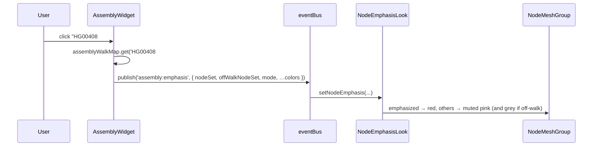

# Story: the Assembly widget

> *"Show me this individual's path through the variation."*

The Assembly widget is the simplest of the three theme widgets. It is a long,
searchable list of names — every assembly-haplotype in the dataset. The user
picks one. The graph rearranges its attention around that single individual.
That is the whole gesture.

---

## 1. The widget

Open the Assembly card and you see:

- **A search field** at the top.
- **A scrollable list** — for `il7.json`, 466 rows, one per
  assembly-haplotype. Each row is a small color chip and a label like
  `HG00408 hap1`.
- **A mode toggle** — *Assembly Subgraph* (default) vs *Assembly Walk*.

The gesture is binary at any instant: zero or one assembly is selected.
Clicking the selected row again deselects it and the graph returns to
neutral.

The widget's job is to make this choice fast in a list of hundreds. The
search field filters by substring; the toggle reshapes *what selection
means* without changing *which* assembly is selected.

`src/widgets/assemblyWidget.ts`

---

## 2. What the widget is reading

The list is populated from `genomicService.assemblySet` — the keys of the
dataset's top-level `assembly` map. That map is the dataset's
**roster**: one entry per assembly-haplotype.

```
"assembly": {
  "HG00408#1": { "sequence_id": "CM085957.1", "region": "78567196-78786401" },
  …  ×466
}
```

Per-entry, the data is thin. `sequence_id` and `region` are just enough to
say *which contig in this individual's genome this graph lives in*. The
widget itself shows only the key, split into name and haplotype.

The *power* of each row comes from a derived structure built at ingest:

```
genomicService.assemblyWalkMap : Map<assemblyKey, { spineFeatures, assemblySubgraph }>
```

This map is the **inversion** of the dataset's per-node `assembly[]` lists.
The dataset stores, per node, *"which assemblies pass through me?"* The
widget needs the dual: *"which nodes does this assembly pass through?"*
Building `assemblyWalkMap` once at load time is what turns a single click
into an O(1) node-set lookup.

This is the load-bearing transformation behind the widget. Without it, the
gesture is intractable.

---

## 3. What the scene does in response

Selection publishes `assembly:emphasis`; `NodeEmphasisLook` is subscribed
and recolors the node meshes.



### The two modes

The mode toggle is the heart of the widget's expressive range — two
different biological questions, same selected assembly.

| Mode | `nodeSet` | Off-walk | The question being asked |
|---|---|---|---|
| **Subgraph** *(default)* | every node the assembly touches anywhere | — | "What variation does this individual carry?" |
| **Walk** | only the nodes on the assembly's spine | the rest of its subgraph, greyed | "What exact path does this individual's genome take through the graph?" |

In *Walk* mode the third color (off-walk grey) lets the eye see the
difference between *"on the spine"* and *"present but bypassed."* This
visual distinction is the entire reason Walk mode exists.

Deselection publishes `assembly:normal` with the *full* node-name set —
restoring every node to neutral, not just the previously-emphasized ones.
This makes the widget safe to re-toggle without leaking state.

`src/looks/nodeEmphasisLook.ts`

---

## 4. What the scientist is doing

The Assembly widget supports the **case-study gesture**: a scientist picks
one specific sample (often someone of interest from a clinical or
ancestry context) and asks how that individual's genome is laid down on
the graph. The answer reads in two complementary ways:

- *Subgraph view* gives a sense of **how much of this region's variation
  this individual sees** — wide spread = touches many alternative alleles;
  narrow spread = sticks close to a single haplotype.
- *Walk view* gives the **literal path** — useful when comparing two
  assemblies side by side (toggle between them) to spot where their
  trajectories diverge.

The widget itself is deliberately minimal. There is no plot, no panel of
sequence detail, no comparison view. The graph is the answer; the widget
is the question.

---

## 5. What this story doesn't tell you

- **Aggregate frequency across assemblies** — *"how common is this
  variant?"* — is the [Population story](./population.md). That's the same
  data (`node.assembly[]`) viewed in summary rather than per-individual.
- **The assembly's position in learned space** — *"who is genetically
  similar to whom?"* — is the [PCLAI story](./pclai.md). Same individuals,
  different question.
- **The individual's actual DNA** is in `dataset.sequence` and is not
  what the widget is for.

The Assembly widget answers one question — *"where does this individual
go?"* — and hands every other question off to a sibling.

---

## Pointers

- Widget: `src/widgets/assemblyWidget.ts`
- Look: `src/looks/nodeEmphasisLook.ts`
- Derived map: `genomicService.assemblyWalkMap` (built in `src/genomicService.js`)
- Data shape: `dataset.assembly` (roster) and per-node `node.assembly[]`
  (the inverted view) — see [`dataset-skeleton.html`](../dataset-skeleton.html).
