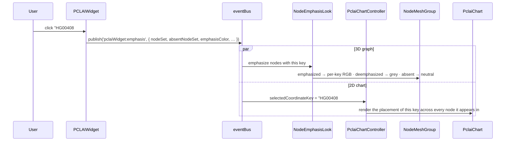

# Story: the PCLAI widget

> *"Where, in PCA-derived ancestry space, does each haplotype's point
> cloud spread — and where are the breakpoints between its ancestral
> segments?"*

The PCLAI widget is the most ambitious of the three. It is the only one
that drives **two coupled visualizations at once**: it emphasizes nodes in
the 3D graph *and* steers a separate 2D chart. The widget's list is the
gesture surface; the graph and the chart are two synchronized views of
what that gesture means.

**PCLAI** ("Point Cloud Local Ancestry Inference"; Geleta et al., *Nature
Genetics* 2026) is a continuous alternative to discrete local ancestry
inference. Instead of labeling each genomic window with one of a few
ancestry categories, PCLAI assigns each window a **coordinate** in a
genetic embedding space — by default the **PCA space** of a labeled
reference panel, where Euclidean distance approximates the F₂ genetic
distance. An individual haplotype is therefore not a string of labels but
a **point cloud**: one point per genomic window, scattered through PCA
space according to local ancestry.

In PGB, each graph node represents one such genomic-window-aligned
haplotypic segment. So every node carries a PCA coordinate per
assembly-haplotype that walks through it — exactly the per-window
coordinates the PCLAI model produces. The boundaries between graph nodes
are, structurally, the recombination **breakpoints** the model regresses
between.

---

## 1. The widget

Open the PCLAI card and you see:

- A **search field**.
- A **scrollable list of coordinate keys** — strings of the form
  `ASM#HAP` (e.g. `HG00408#1`). Visually it looks identical to the
  Assembly list, but each row here is a *placement-bearing identity*, not
  just an assembly identity.

The gesture is binary again: zero or one coordinate key is selected.

But the widget has a second behavior the other two do not: just by being
**open**, it activates an **absence** mode. Every node that lacks
PCLAI placement data is marked with a distinct neutral color from the
moment the card appears — before the user has selected anything. The mere
act of opening the widget reveals where the placement model could not
speak. (This is bookkeeping that survives card close/reopen via
`pclaiAbsenceCoordinator`.)

`src/widgets/pclaiWidget.ts`

---

## 2. What the widget is reading

The list is populated from `pclaiCoordinateService.getAllCoordinateKeys()`
— the union of every coordinate key that appears anywhere in any node's
`pclai_hg38` or `pclai_asm` block. The service builds, at load time, a
dense set of indexes from the dataset's per-node placement data:

| Index | Shape | Used by |
|---|---|---|
| `coordinatesForNode` | `nodeId → Map<coordKey, {coords, RGB}>` | chart, on hover |
| `coordinatesForCoordinateKey` | `coordKey → Map<nodeId, {coords, RGB}>` | chart, on selection |
| `nodeIdsWithCoordinateKey` | `coordKey → Set<nodeId>` | 3D graph emphasis |
| `absentNodeSet` | `Set<nodeId>` (nodes with `pclai_hg38 == {}`) | absence coloring |
| per-key color maps | `coordKey → (nodeId → RGB)` | 3D graph color |

Like the assembly story, the *data-as-stored* shape (per-node lists of
placements) is inverted at ingest into a *data-as-used* shape (per-key
lookups). Without these indexes, every gesture would scan the entire
dataset.

The colors in PCLAI are not chosen — **they ship with the data**, in
the `RGB` field next to each coordinate. They are the model's own
visual encoding of each point's PCA location (so that two points close
in PCA space are also close in color); the visualization reads them,
it does not interpret.

Each node carries two PCLAI blocks side by side — `pclai_hg38` and
`pclai_asm` — distinguished by their `pclai_coord_system` field
(`"GRCh38"` vs `"assembly"`). The two indicate which coordinate system
the window was anchored in; both produce a `[x, y]` PCA placement, an
`RGB`, and a `confidence_score`. Either may be empty (`{}`) for a
given node-assembly pair when the model has no placement to report.

`src/widgets/pclaiCoordinateService.js`

---

## 3. What the scene does in response

A single selection drives two listeners in lockstep — the 3D graph and
the 2D chart.

### The chart's state machine

The PCLAI chart is a 2D scatter of the PCA space. Its constant backdrop is
the **reference panel** — the labeled populations PCLAI was trained
against (loaded from `hprc-reference-pca.tsv`), drawn as colored dots
that visually divide the space into AFR / EUR / EAS / AMR / WAS regions.
Every other dot the chart draws is read against this backdrop.

The controller renders the chart as a **pure function** of two pieces of
state:

| `hovered` (a node) | `selected` (a coord key) | Chart shows |
|---|---|---|
| ∅ | ∅ | **Idle** — reference panel only, full color |
| set | ∅ | One genomic window, **every haplotype's placement** at that window |
| ∅ | set | One haplotype, **its full point cloud** across every node it walks |
| set | set | The **single** point: this haplotype at this node |

The hovered node comes from a graph-side raycaster firing
`lineIntersection`; the selected coord key comes from a widget click.
Crossing the two is what makes the chart feel coupled to the graph.

`src/widgets/pclaiChartController.js` · `src/widgets/pclaiChart.js`

### The three node colorings, simultaneously

In emphasis mode the graph's nodes are painted in three categories at
once:

- **Emphasized** — nodes that carry the selected coord key, painted in
  the per-node RGB the data ships with.
- **Deemphasized** — nodes that have PCLAI placements but not for this
  key, painted muted grey.
- **Absent** — nodes that have no PCLAI placement at all, painted in a
  separate neutral tone.

The absence color is reserved — it stays even with no selection (whenever
the widget is open), so the user always knows which nodes the model is
*silent* about. This is what makes PCLAI's third category necessary;
neither Assembly nor Population needs to express "no data."

---

## 4. What the scientist is doing

PCLAI supports the **placement gesture**: rather than asking *which
individuals* (Assembly) or *which populations* (Population), the scientist
asks *where in PCA space* each haplotype's genomic segments sit, and
reads admixture and recombination structure directly off the cloud's
geometry. The paper's central observation is that the **shape and
spread of a haplotype's point cloud (Tr(Σ), the trace of its covariance)
is itself the admixture signal** — tight clusters mean single-ancestry
haplotypes; broad, multi-modal clouds mean admixed ones.

Three readings the gesture supports:

- **Hover a node, see a cross-section.** With no selection, hovering a
  node populates the chart with every haplotype's placement at that
  single genomic window. A tight cluster within one reference region
  means most individuals trace this segment to the same ancestry; a
  spread-out cloud means the locus is itself a site of high
  inter-individual variation.
- **Select a haplotype, see its point cloud.** With one coord key
  selected, the chart shows the haplotype's *entire* point cloud — one
  dot per node it walks. A tight cluster inside one reference region
  (e.g. EUR) means this individual's ancestry is largely from there.
  Multiple separated clusters (EUR + AMR, say) reveal admixture, and
  the visible cluster sizes are proportional to how much of the genome
  traces to each. An elongated single axis suggests admixture along
  one drift direction.
- **Hover and select together, see one point.** The intersection: where
  does *this specific haplotype* place at *this specific genomic
  window*? A single dot, or nothing if the model has no opinion.

The simultaneous 3D-graph emphasis grounds every chart reading
spatially: the chart says *where in PCA space*, the graph says *where
on the genome*. When the same individual's PCA dots hop between
reference regions as you move along the graph, the node boundaries
where the hop happens are the candidate **recombination breakpoints**
PCLAI is built to detect. Neither view alone tells that story.

---

## 5. What this story doesn't tell you

- **Which individuals merely *visit* a node** — the
  [Assembly widget](./assembly.md) covers presence-on-graph; PCLAI
  covers *placement-in-learned-space*, which is a much stronger claim.
- **Aggregate distribution by ancestry group** — the
  [Population widget](./population.md) gives the demographic landscape
  view, without per-individual coordinates.
- **Why the model is silent on some nodes** (the absent set) — that is
  the heart of [Issue #77](../../../notes/pangenome/), still open.

The PCLAI widget answers two questions at once — *"where in PCA
space?"* and *"with which recombination structure?"* — by binding a list
selection to a graph emphasis and a chart render in the same gesture.

---

## Pointers

- Widget: `src/widgets/pclaiWidget.ts`
- Service: `src/widgets/pclaiCoordinateService.js`
- 3D look: `src/looks/nodeEmphasisLook.ts` (shared with Assembly)
- Chart: `src/widgets/pclaiChart.js` · `src/widgets/pclaiCoordinateSpace.js`
- Chart controller (state machine): `src/widgets/pclaiChartController.js`
- Absence coordinator: `src/widgets/pclaiAbsenceCoordinator.js`
- Data shape: `pclai_hg38` and `pclai_asm` blocks per node — see
  [`dataset-skeleton.html`](../dataset-skeleton.html).
- Reference paper: Geleta, Bu, Turner, et al. *Point cloud local
  ancestry inference (PCLAI): continuous coordinate-based ancestry
  along the genome.* Nature Genetics, 2026.
  (`~/PanGenomeProject/pclai-nature-paper-2026/`)
- Reference panel: `hprc-reference-pca.tsv` — the labeled PCA backdrop
  for the chart.
