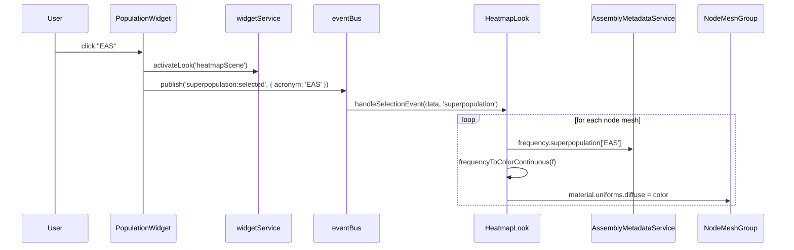

# Story: the Population widget

> *"Where, on the map of human ancestry, is this allele concentrated?"*

The Population widget pivots the same dataset to a different question. Where
the [Assembly widget](./assembly.md) asks *"where does this individual go?"*,
the Population widget asks *"who, demographically, carries each piece of this
graph?"* — and paints the answer across the whole graph at once.

---

## 1. The widget

Open the Population card and you see:

- A **two-level list**: six **superpopulations** (AFR, AMR, EAS, EUR, SAS,
  plus an "Other"-style catch-all), each expandable into its constituent
  **populations** (28 in total for HPRC-style data).
- Buttons everywhere — every superpopulation and every population is its
  own clickable button.

The gesture is binary: zero or one bucket is selected at any time, and the
selection can sit at *either* level of the hierarchy. Clicking the selected
bucket again deselects it; clicking a different bucket replaces the
selection without an intermediate empty state.

`src/widgets/populationWidget.ts`

---

## 2. What the widget is reading

The list's *shape* — which populations roll up into which superpopulation —
comes from a static hierarchical table in
`src/utils/populationUtils.js`. That table is the canonical ancestry
taxonomy; the widget walks it to build the rows.

The list's *content* — the specific buckets to show — is filtered against
the dataset so that only populations actually represented in this dataset's
`assembly_metadata` buckets are drawn. A locus with no AMR samples will
still show "AMR" as a header (the taxonomy is fixed) but its populations
list will reflect the data.

Crucially, **the widget itself does not read any frequency values**. It
emits an acronym; the *look* on the other end of the bus is the consumer
of `assembly_metadata`. This separation is what lets the same widget drive
two different scales of question — superpopulation vs population — without
duplicating logic.

---

## 3. What the scene does in response

Selection does two things in lockstep:

1. **Switches the active look** from `NodeEmphasisLook` (the default) to
   `HeatmapLook`. The graph's appearance is, fundamentally, a different
   visualization now.
2. **Publishes the bucket choice** as `superpopulation:selected` or
   `population:selected` with `{ acronym }`.

Deselection switches the look back to `nodeEmphasisScene` and publishes
`*:deselected`. The whole scene reverts to neutral.

### The two scales

The hierarchy in the widget directly mirrors a tradeoff in the data:

| Level | Bucket count | What the gradient looks like | The question |
|---|---|---|---|
| **Superpopulation** | 6 | Smooth, broad — many alleles approach 1.0 within a continental group | "Is this allele continent-specific?" |
| **Population** | 28 | Sparser, higher-contrast — many alleles are 0 or 1 within a single population of ~25 | "Is this allele *specifically* enriched here?" |

Selecting at the superpopulation level answers a continent-scale question;
drilling into a population narrows to a single sampled cohort. The widget
makes both available without forcing the user to think about the rollup.

`src/looks/heatmapLook.ts` · `src/assemblyMetadataService.ts` · `src/utils/color/tufteHeatmapColors.js`

---

## 4. What the scientist is doing

The Population widget supports the **survey gesture**: instead of asking
about one individual, the scientist asks about the *whole graph* through a
demographic lens. The eye reads the result not node-by-node but as a
landscape.

- A node that paints **bright** under "AFR" and **dark** under "EAS"
  is a candidate for population-specific variation.
- A node that paints **uniformly bright** across every selection is part
  of the **core graph** — shared by essentially everyone.
- A node that paints **uniformly dark** is a **rare allele**.

The hover tooltip on any node (powered by the same
`assemblyMetadataService`) gives the full demographic breakdown — every
population, with counts and percentages — so the scientist can drop from
the landscape view down into per-node detail without leaving the gesture.

The Population widget is the only one of the three theme widgets that
**changes the look**. The others modulate the existing look's parameters;
this one swaps the visualization wholesale. That swap *is* the answer
to the question.

---

## 5. What this story doesn't tell you

- **Which specific individuals carry this allele** — the
  [Assembly widget](./assembly.md) does that, one at a time.
- **How those individuals cluster in learned space** — the
  [PCLAI widget](./pclai.md) does that.
- The data backing the heatmap is `assembly_metadata.frequency` per node;
  the surrounding fields (`count`, `sex`) and the raw `assembly[]` list
  the buckets are derived from are described in
  [`dataset-skeleton.html`](../dataset-skeleton.html).

The Population widget answers one question — *"who, demographically,
carries this?"* — by recoloring the entire graph as a single gradient.

---

## Pointers

- Widget: `src/widgets/populationWidget.ts`
- Look: `src/looks/heatmapLook.ts` (activated on selection)
- Data source: `assembly_metadata.frequency` per node
- Taxonomy: `src/utils/populationUtils.js`
- Tooltip / breakdown HTML: `src/assemblyMetadataService.ts`
