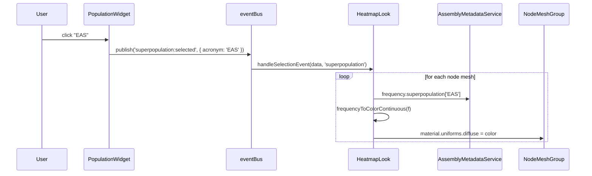

# Story: `assembly_metadata`

> *"How common is this stretch of DNA, and in which human populations?"*

This is one of the easiest stories to tell in PGB, because the data, the
visualization, and the scientific question line up cleanly. A scientist
hovering over a node should be able to answer, at a glance, **whether this
allele is shared by everyone or carried by a few**, and **whether its
distribution is even across the world or concentrated in one ancestry**.

---

## 1. What the data says

Every node in the graph carries one `assembly_metadata` object. It is a
pre-computed summary of the node's `assembly[]` array — the list of
assembly-haplotypes that walk through this node — bucketed by demographic
attribute.

```
"assembly_metadata": {
  "count":     { "sex": {...×2}, "superpopulation": {...×6}, "population": {...×28} },
  "frequency": { "sex": {...×2}, "superpopulation": {...×6}, "population": {...×28} }
}
```

Two parallel trees with identical keys: `count` is *how many* assemblies fall
into each bucket; `frequency` is the same number as a fraction in `[0, 1]`.
The buckets nest naturally — 28 populations roll up into 6 superpopulations —
but the data itself is flat, and the rollup is reconstructed at display time
from `utils/populationUtils.js`.

**The shape carries the claim.** Every node, no matter how rare, gets the
full set of buckets. A frequency of `0` is the data's way of saying *"no one
in this population carries this allele"*; the bucket is present but empty.
This is what makes a coherent population-wide visualization possible — there
are no missing keys to handle, only varying numbers.

See [`dataset-skeleton.html`](../dataset-skeleton.html) for the field-by-field
reference, and [`dataset-anatomy.md`](../dataset-anatomy.md) for the surrounding
context.

---

## 2. How the app realizes it

`assembly_metadata` is the entire input to **`HeatmapLook`**. That look
exists for one purpose: paint each node by the frequency of a chosen
demographic bucket, so the eye reads node-by-node variation as a single
gradient.

The pieces:

| Piece | File | Role |
|---|---|---|
| **AssemblyMetadataService** | `src/assemblyMetadataService.ts` | Singleton. Loads each node's `count`/`frequency` into a `Map<nodeId, …>` at dataset-ingest time. Also renders tooltip HTML. |
| **PopulationWidget** | `src/widgets/populationWidget.ts` | Scrollable list of the 6 superpopulations and their 28 populations. The user's *gesture surface*. |
| **HeatmapLook** | `src/looks/heatmapLook.ts` | The active Look while this story is on screen. Subscribes to widget events and recolors node meshes. |
| **tufteHeatmapColors** | `src/utils/color/tufteHeatmapColors.js` | Maps a `[0,1]` frequency to a perceptually-uniform color. |

### Sequence



Hovering a node fires the tooltip path through the same service:
`createNodeTooltipContent` → `assemblyMetadataService.getPopulationTooltip(nodeId)`
which renders all 28 populations with counts and percentages, emphasizing
the currently-selected one.

### The two viewing modes

- **Superpopulation mode** (`superpopulation:selected`) — one of 6 buckets
  drives node color. Coarse view; the whole graph paints with broad strokes.
- **Population mode** (`population:selected`) — one of 28 finer-grained
  buckets drives color. Most populations are smaller, so the gradient
  contrast is generally higher and the rare-allele nodes pop visually.

Deselection (`*:deselected`) is currently a logged no-op — colors are
reset by selecting a different bucket or switching looks.

---

## 3. What the scientist sees

The biological story the visual is making:

- A node that paints **bright** under "AFR" but **dark** under "EAS"
  is an allele present in most African-ancestry samples but rare or
  absent in East Asian ones — a candidate for population-specific variation.
- A node that paints **uniformly bright** across every superpopulation
  selection is part of the **core graph** — shared by essentially everyone,
  the boring backbone the interesting variation departs from.
- A node that paints **uniformly dark** is a **rare allele**, present in a
  handful of samples regardless of how you slice the population.

This is the moment of decision the entire visualization is engineered
around: a scientist picks "EAS" in the widget; their eye scans the ribbon
graph; the bright nodes are the East-Asian-enriched alleles; they click
through to inspect the sequence and metadata. The story ends in a
biological hypothesis the data alone couldn't make obvious.

---

## 4. What this story *doesn't* tell you

- **No individual identities.** `assembly_metadata` is aggregate. Which
  *specific* assemblies walk this node is the `assembly[]` array next door
  — a different story, with a different look (`NodeEmphasisLook`) and a
  different widget (assembly selection).
- **No spatial coordinates.** Whether the node sits "near" another node in
  some learned space is the `pclai_*` story — yet another look, the PCLAI
  scatter chart.
- **No geometry.** Where the node *lives on screen* is `ogdf_coordinates`
  — a story about layout, not biology.

`assembly_metadata` answers "who carries this?" and only that. The
codebase's separation of looks mirrors the dataset's separation of
concerns: one look per question.

---

## Pointers

- Data: `assembly_metadata` field — see skeleton row in
  [`dataset-skeleton.html`](../dataset-skeleton.html).
- Look: `src/looks/heatmapLook.ts`
- Service: `src/assemblyMetadataService.ts`
- Widget: `src/widgets/populationWidget.ts`
- Color ramp: `src/utils/color/tufteHeatmapColors.js`
- Architecture context: [`notes/architecture/`](../../architecture/)
