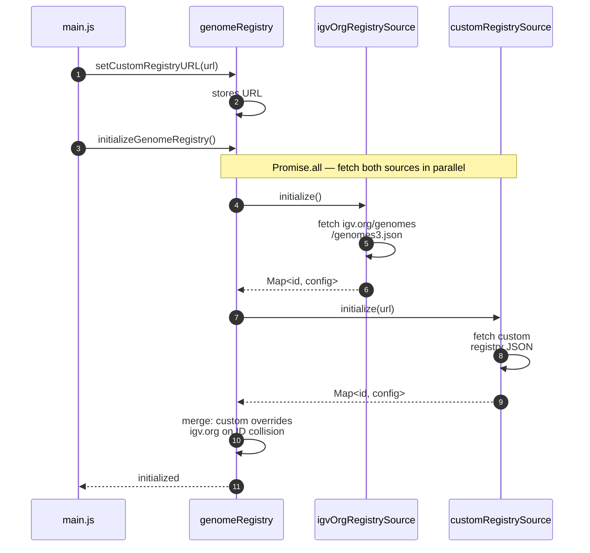
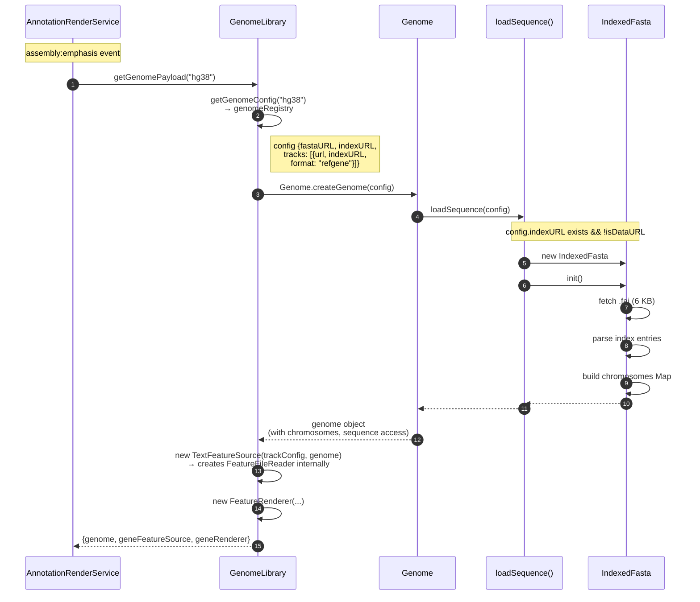
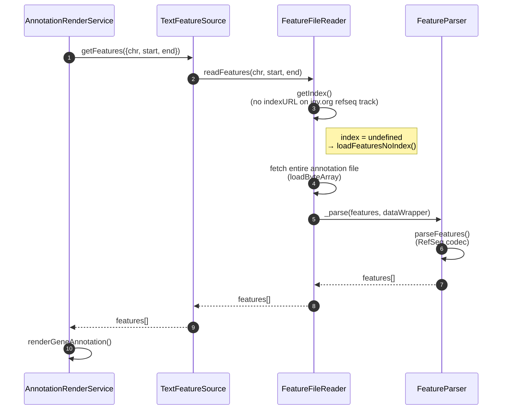
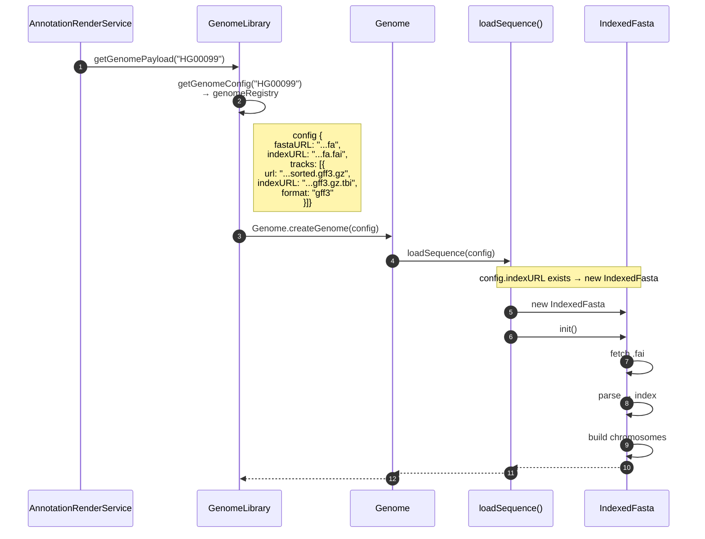
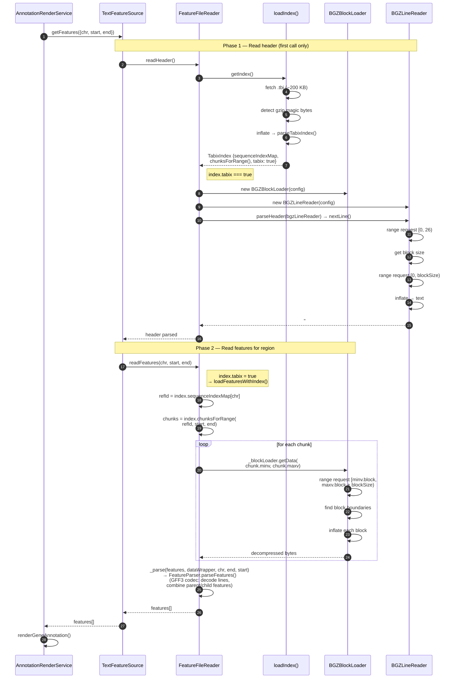
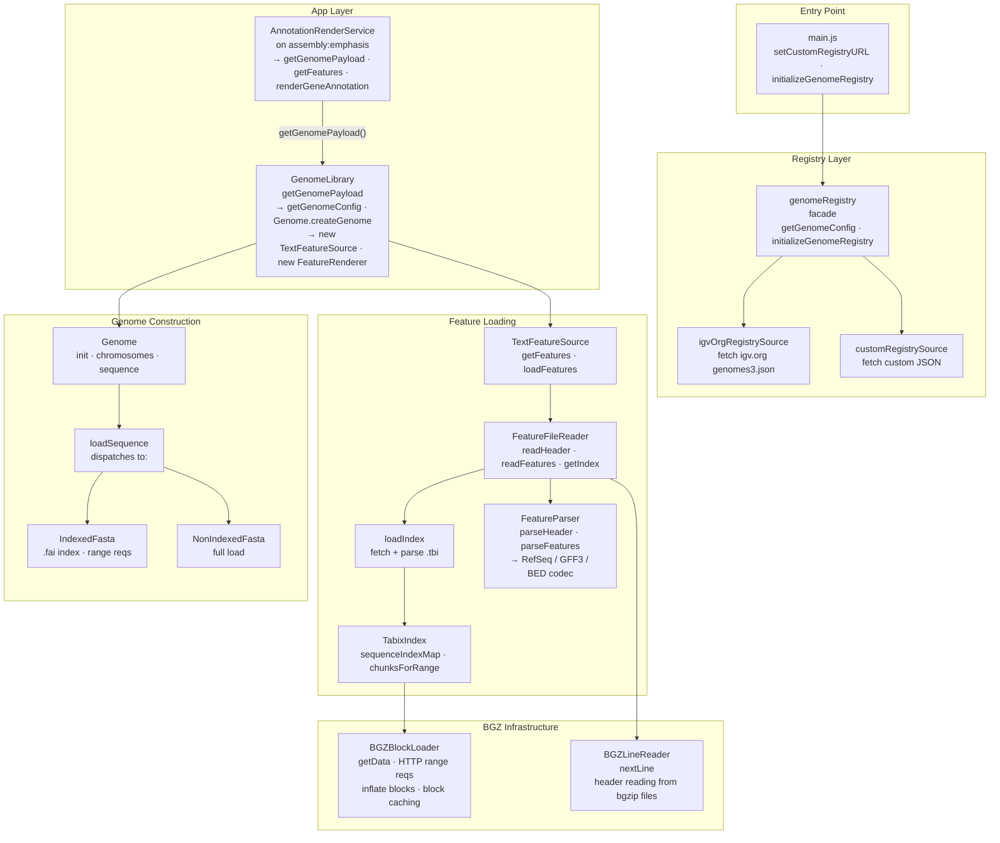

# Genome Loading Architecture

## Overview

PGB loads genome data through a pipeline of classes ported and refactored from igv.js. There are two distinct paths through this pipeline, determined by the genome config:

1. **igv.org known genomes** — standard reference genomes (hg38, mm39, etc.) fetched from igv.org's curated registry, with RefSeq annotations
2. **Custom genomes** — scientist-designed experimental genomes loaded from a custom JSON registry, typically using indexed FASTA + tabix-indexed GFF3

Both paths share the same class hierarchy but diverge at key branching points based on config properties — primarily the presence or absence of `indexURL` fields.

---

## Class Inventory

The pipeline involves these classes, listed in call order:

| Class / Module | File | Role |
|---|---|---|
| `main.js` | `src/main.js` | App entry point; sets custom registry URL, initializes registry |
| `genomeRegistry` | `src/igvCore/genome/genomeRegistry.js` | Facade: merges igv.org + custom sources into one config Map |
| `igvOrgRegistrySource` | `src/igvCore/genome/igvOrgRegistrySource.js` | Fetches genome configs from igv.org (with backup URL) |
| `customRegistrySource` | `src/igvCore/genome/customRegistrySource.js` | Fetches genome configs from a developer-specified JSON URL |
| `GenomeLibrary` | `src/igvCore/genome/genomeLibrary.js` | Creates Genome + feature source + renderer for a genome ID |
| `Genome` | `src/igvCore/genome/genome.js` | Genome object: holds sequence, chromosomes, tracks |
| `loadSequence()` | `src/igvCore/genome/loadSequence.js` | Factory: dispatches to IndexedFasta or NonIndexedFasta |
| `IndexedFasta` | `src/igvCore/genome/indexedFasta.js` | Loads sequence via `.fai` index + HTTP range requests |
| `NonIndexedFasta` | `src/igvCore/genome/nonIndexedFasta.js` | Loads entire FASTA file into memory |
| `TextFeatureSource` | `src/igvCore/io/textFeatureSource.js` | Wraps FeatureFileReader; provides caching and chr aliasing |
| `FeatureFileReader` | `src/igvCore/io/featureFileReader.js` | Reads features from BED/GFF3/VCF; indexed or full-file |
| `loadIndex()` | `src/igvCore/io/indexFactory.js` | Loads and parses `.tbi` index files |
| `TabixIndex` | `src/igvCore/io/tabixIndex.js` | Parsed tabix index with `chunksForRange()` for region queries |
| `BGZBlockLoader` | `src/igvCore/io/bgzBlockLoader.js` | Fetches + decompresses bgzip blocks via HTTP range requests |
| `BGZLineReader` | `src/igvCore/io/bgzLineReader.js` | Reads header lines from bgzipped files block by block |
| `FeatureParser` | `src/igvCore/feature/featureParser.js` | Parses tab-delimited feature lines; dispatches to GFF3 codec |
| `AnnotationRenderService` | `src/annotationRenderService.js` | App-side: triggers genome loading on assembly emphasis |

---

## Sequence Diagram: Registry Initialization

Both paths begin with the same initialization at app startup.



After initialization, `genomeRegistry` holds a single merged `Map<genomeId, config>` accessible via `getGenomeConfig(id)`.

---

## Sequence Diagram: Path 1 — igv.org Known Genome (e.g., hg38)

This path is triggered when a user emphasizes an assembly whose genome ID (e.g., "hg38") matches an igv.org registry entry. The igv.org config typically has `indexURL` for both the FASTA and the annotation track.



### Feature Loading (on-demand)

After the genome is created, `AnnotationRenderService` requests features for the visible region:



Note: Many igv.org tracks (e.g., RefSeq for hg38) are small enough to load fully. If the igv.org config includes an `indexURL` on the track, the indexed path (same as Path 2 below) would be used instead.

---

## Sequence Diagram: Path 2 — Custom Genome with Indexed FASTA + Tabix GFF3

This path is triggered when the genome ID matches a custom registry entry. The config has `indexURL` for the FASTA and `indexURL` + `format: "gff3"` on the annotation track.

### Genome Creation (same structure, different data)



### Feature Loading — Indexed Path (the key difference)



---

## Interaction Diagram: Component Relationships

This shows the static relationships between all components involved in genome loading.



---

## Branching Points

The two paths diverge at three key decision points, all driven by the presence of `indexURL` in the config:

### 1. `loadSequence()` — FASTA loading strategy

```javascript
// src/igvCore/genome/loadSequence.js

if (reference.indexURL && !isDataURL(reference.fastaURL)) {
    fasta = new IndexedFasta(reference)     // ← has .fai → range requests
} else if (isDataURL(reference.fastaURL) || !reference.indexURL) {
    fasta = new NonIndexedFasta(reference)  // ← no .fai → load entire file
}
```

**Config property**: top-level `indexURL` (points to `.fa.fai`)

### 2. `FeatureFileReader.readFeatures()` — annotation loading strategy

```javascript
// src/igvCore/io/featureFileReader.js

const index = await this.getIndex()
if (index) {
    this.indexed = true
    allFeatures = await this.loadFeaturesWithIndex(chr, start, end)  // ← has .tbi → range requests
} else {
    this.indexed = false
    allFeatures = await this.loadFeaturesNoIndex()                   // ← no .tbi → load entire file
}
```

**Config property**: track-level `indexURL` (points to `.gff3.gz.tbi`)

### 3. `FeatureFileReader.readHeader()` — header reading strategy

```javascript
// src/igvCore/io/featureFileReader.js

if (this.config.indexURL) {
    const index = await this.getIndex()
    if (index.tabix) {
        this._blockLoader = new BGZBlockLoader(this.config)
        const dataWrapper = new BGZLineReader(this.config)        // ← bgzip → read block by block
        this.header = await this.parser.parseHeader(dataWrapper)
    } else {
        // non-tabix index: load first bytes of file                // ← standard HTTP range
    }
} else {
    // no index: load entire file and parse header + features       // ← full download
}
```

---

## Config Comparison

These are the config objects that drive the two paths:

### igv.org genome (hg38)

```json
{
    "id": "hg38",
    "name": "Human (GRCh38/hg38)",
    "fastaURL": "https://s3.amazonaws.com/igv.broadinstitute.org/genomes/seq/hg38/hg38.fa",
    "indexURL": "https://s3.amazonaws.com/igv.broadinstitute.org/genomes/seq/hg38/hg38.fa.fai",
    "tracks": [
        {
            "name": "Refseq Genes",
            "url": "https://s3.amazonaws.com/igv.org.genomes/hg38/refGene.sorted.txt.gz",
            "indexURL": "https://s3.amazonaws.com/igv.org.genomes/hg38/refGene.sorted.txt.gz.tbi",
            "format": "refgene"
        }
    ]
}
```

### Custom genome (HG00099)

```json
{
    "id": "HG00099",
    "name": "HG00099 test file (Cici) - local",
    "fastaURL": "http://localhost:8000/data/genomes/HG00099_hap1_hprc_r2_v1.0.1.fa",
    "indexURL": "http://localhost:8000/data/genomes/HG00099_hap1_hprc_r2_v1.0.1.fa.fai",
    "tracks": [
        {
            "name": "Gene annotations",
            "url": "http://localhost:8000/data/genomes/HG00099...sorted.gff3.gz",
            "indexURL": "http://localhost:8000/data/genomes/HG00099...sorted.gff3.gz.tbi",
            "format": "gff3"
        }
    ]
}
```

The structural difference is minimal — both have the same shape. The key differences are:
- **Source**: igv.org registry vs custom registry JSON
- **Format**: `"refgene"` vs `"gff3"` → determines which codec FeatureParser uses
- **URLs**: S3-hosted vs localhost (in dev) or project-hosted

---

## Data Flow Summary

| Step | igv.org path | Custom genome path |
|------|-------------|-------------------|
| **Registry** | igvOrgRegistrySource → igv.org API | customRegistrySource → local/remote JSON |
| **FASTA** | IndexedFasta + `.fai` | IndexedFasta + `.fai` |
| **FASTA access** | HTTP range requests | HTTP range requests |
| **Annotation format** | RefSeq (refgene) | GFF3 |
| **Annotation index** | `.tbi` (tabix) | `.tbi` (tabix) |
| **Annotation access** | `loadFeaturesWithIndex()` via BGZBlockLoader | `loadFeaturesWithIndex()` via BGZBlockLoader |
| **Feature parsing** | RefSeq codec | GFF3 codec (with parent/child combining) |

Both paths converge on the same indexed infrastructure. The primary differences are the registry source and the annotation format/codec.
