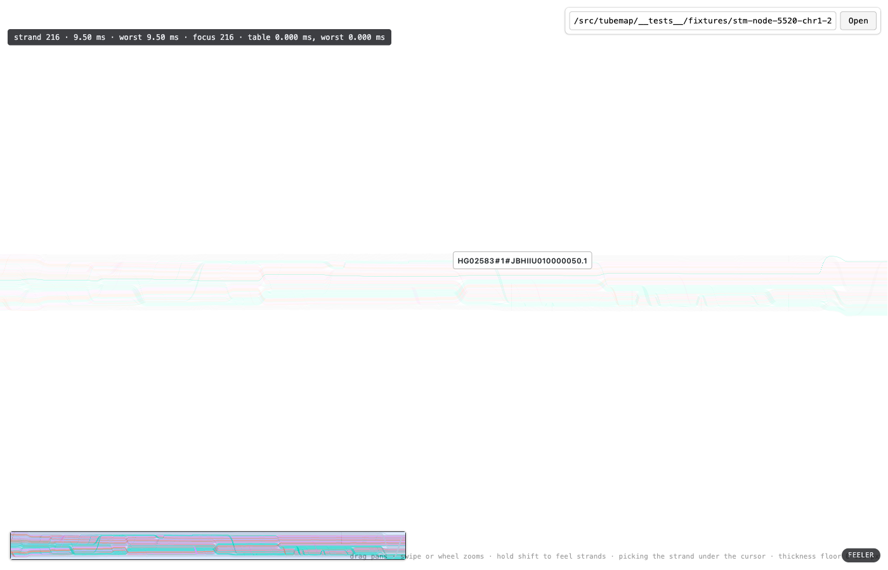
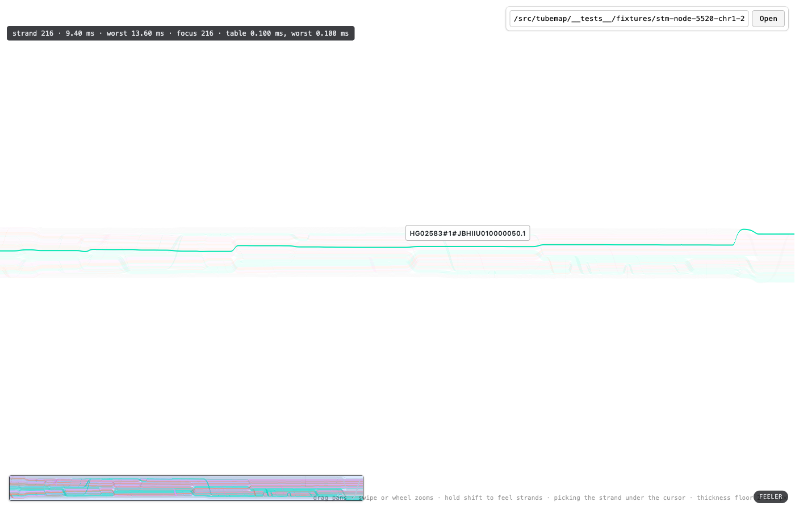

# A thickness floor, and how thick

**Date:** 2026-08-20. **Reproduce:** `npm run dev`, then

```
node scripts/verify_floor.mjs /src/tubemap/__tests__/fixtures/stm-node-5520-chr1-25331646-25335796.svg
```

Headed on purpose — headless chromium falls back to SwiftShader, and a photograph of a
software rasterizer says nothing about this one.

At fit on `5520+` a band is **0.19 css pixels** tall and 2.6 strands share every device pixel
row. Feeler mode recedes the other 463 correctly and the focused strand still cannot be picked
out, because receding does not change how much of a row the focused band owns. #112 proposes a
screen-space floor on that one strand's thickness, grown symmetrically about its centreline.

**The ticket said the argument does not settle it**, and it was right to: the treatment removed
on 2026-08-14 reads like this proposal already failing until you look at the difference. That
one was *tonal* — restore alpha on a 0.19 px band, which is still partial coverage. This one is
*geometric*: the band owns whole device rows outright. Only a photograph separates them, and
only a sweep says how many rows.

## Method

One photograph per candidate floor — 0, 1, 1.5, 2 and 3 css px — all at fit, all with the
feeler parked on the **same strand** at the same cursor position, so the pictures differ in one
thing only. `floor=0` is the control: the map exactly as it was before #112.

The harness parks on strand **216**, `HG02583#1#JBHIIU010000050.1`, `rgb(0, 232, 180)`. Not the
first strand a sweep touches: that is `HG00133#2` on the top edge of the bundle, whose PCLAI
colour is the grey that means *no placement*, so it is both the easiest strand to find — nothing
is crowding it — and the hardest to see. 216 is the most saturated strand in the middle third
of the bundle. A coloured strand, buried.

Coverage below is measured off the photographs afterwards, at x = 200, 700 and 1100, as the
fraction of the strand's own colour reached at each row: `(255 − pixel) / (255 − rgb(0,232,180))`.
`1.0` is the strand's own colour, undiluted. The screenshots are 1 css px per pixel; the display
is retina, so one row here is two device rows. The harness takes the photographs and does not
read them back — this is the reading, and it is one `pillow` loop over the five files:

```python
from PIL import Image
import numpy as np

target = np.array([0, 232, 180])

for floor in ['0', '1', '1.5', '2', '3']:
    a = np.asarray(Image.open(f'floor-5520-at-fit-{floor}.png').convert('RGB')).astype(int)

    for x in [200, 700, 1100]:
        frac = ((255 - a[395:445, x]) / (255 - target)).mean(axis=1)
        print(floor, x, (frac > 0.5).sum(), round(float(frac.max()), 2))
```

## The sweep

| floor | rows at ≥ 50% coverage | peak fraction of its own colour | verdict |
|---|---|---|---|
| 0 (control) | 0, 0, 0 | 0.25, 0.28, 0.23 | **invisible.** Never reaches a quarter of its colour anywhere |
| 1.0 | 1, 1, 2 | 0.94, 1.06, **0.61** | traceable, but fades where it is crossed |
| 1.5 | 2, 1, 2 | 1.02, 1.06, **0.83** | nearly; still dilutes in places |
| **2.0** | **2, 3, 2** | **1.02, 1.06, 1.06** | **full colour at every sample. Chosen** |
| 3.0 | 3, 3, 4 | 1.17, 1.11, 1.14 | reads as an overlay drawn on the map, not a strand in it |





**Why the losers lost.**

- **1.0** and **1.5** both put a line on screen where there was none, and both leave it pale
  where the strand passes under a crowd — 0.61 and 0.83 of its own colour at x = 1100. A
  haplotype that thins out halfway along is one the eye loses halfway along, which is the
  failure the floor exists to end.
- **3.0** is legible and dishonest in a way 2.0 is not. The bundle is 89 css px for 464 strands,
  so 3 px is the screen space of about **16 neighbours**; the band stops reading as one strand
  among many and starts reading as a mark laid over them. Fractions above 1.0 are the
  give-away — the band is compositing *darker* than its own colour, over strands it has
  swallowed.
- **2.0** is the smallest value that is at full colour at every sample. Two css px is four
  device rows, which is the ticket's "three or four device rows outright", reached from below
  rather than assumed.

## Above the floor, the clamp does nothing

The property the floor is defensible on is that it is self-annulling: where the band is already
thicker than the floor, the arithmetic is exactly what it was. That is checkable rather than
assertable, and the harness checks it. Zoomed to the camera's ceiling — 200× fit, where a band
is 38 css px — with the feeler held on one strand, the canvas at `floor=0` and the canvas at
`floor=3` are **byte-identical**. At fit the same two differ, which is the positive control
saying the comparison can tell them apart at all.

What that compares is the shipped shader with the clamp inert against the shipped shader with
the clamp switched off, not against the code before #112. It is the honest form of the claim
available to a harness that drives one build: the two arms differ in the floor byte alone, and
`floor=0` drives `vGrow` to zero on every strand, which is the arithmetic that was here before.
A comparison against `main` would need two builds and a pixel-exact camera between them.

## What the floor is not

**It is not applied to the pick pass.** `bandPicker.ts` sets `uFloorPixel` to zero, so picking
sees the document's own geometry. The floor dilates the strand the *previous* pick answered
with; honouring it in the pick would let that answer widen its own target, and at fit the
floored strand covers ten of its neighbours' rows — a sweep could never get past it. The floor
shows the researcher the strand they have got; it is not how they get it.

**It is not a comparison set.** Exactly one strand carries a floor, following the feeler, for
the same reason exactly one is emphasized (`strandAppearance.ts`).

**It is not tone.** Nothing here brightens a band beyond the colour the document gave it. The
removed 2026-08-14 treatment stays removed.
