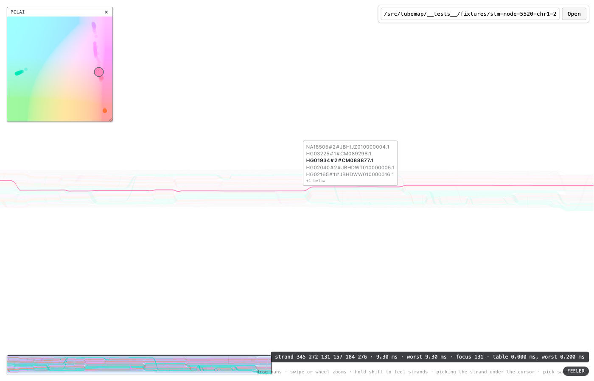
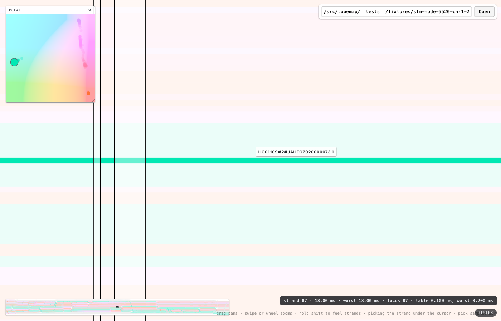

# How finely to sample a pick

**Date:** 2026-08-21. **Reproduce:** `npm run dev`, then

```
node scripts/verify_pick_set.mjs /src/tubemap/__tests__/fixtures/stm-node-5520-chr1-25331646-25335796.svg
```

Headed on purpose — headless chromium falls back to SwiftShader, where the readback is
software rasterization and the numbers say nothing about this one.

At fit on `5520+` a band is **0.19 css pixels** tall and about five haplotypes lie inside the
cursor's css pixel. The pick pass framed exactly that pixel and photographed it into a
`1 x 1` target: with no depth buffer the last fragment written won, so the answer was whichever
band came last in document order and the other four were discarded with nothing on screen
saying they had existed (#120).

The fix keeps the window and raises the resolution: the same one css pixel of map, read back
as a `1 x N` column, each texel `1/N` css px. **N is the number this note chooses.**

`uPad` moves with it. The pad exists so a hairline cannot fall between sample points and it is
quoted against the sample cell, which is now `1/N` css px rather than one. Left at a whole css
pixel every band would inflate across the entire column and the readout would name strands
that were never under the cursor — which is the failure the *inside* column below watches for.

## Method

Sixty cursor rows through the middle of the canvas, at fit, felt at every candidate N, on the
real GPU. Every set — and which strand of it the feeler has lit — is read out of the surface's
own `?pick` readout; nothing is predicted that can be read. The sweep holds `Shift` for exactly
that reason: `focus` is written from the appearance table, so it says nothing unless the feeler
is out. The finest arm, `N = 128`, is the reference the others are scored against — not because
it is truth, but because it is the closest available to it.

- **named/row** — mean strands named, over the rows that answered at all.
- **same set** — rows where this arm named exactly what `128` named, in the same order. Not
  the same *count*: two arms naming five strands each is not two arms naming the same five.
- **same label** — rows where the label would draw the same thing: the `NAME_CAP` names the
  cap lets through, centred on the strand the readout says is lit, and both hidden counts. The
  only column a researcher can see, and always the stricter of the two — an arm can name the
  same set and still window it differently, because the lit strand moved.
- **inside** — rows where every strand this arm named was also named by `128`. This is the
  claim about the pad: a coarse arm may miss a sliver the fine one caught, but it must never
  invent one, because both frame the same css pixel.
- **ms/pick** — the pass including its synchronous readback stall, off the same readout.

## The sweep

| samples | named/row | most | same set | same label | inside | ms/pick | worst |
|---|---|---|---|---|---|---|---|
| 1 (control) | 1.00 | 1 | 0/60 | 0/60 | 60/60 | 6.51 | 9.20 |
| 2 | 1.92 | 2 | 0/60 | 0/60 | 60/60 | 6.41 | 9.40 |
| 4 | 3.63 | 4 | 0/60 | 0/60 | 60/60 | 6.35 | 9.10 |
| 8 | 5.32 | 6 | 16/60 | 6/60 | 60/60 | 6.55 | 11.50 |
| 16 | 5.85 | 7 | 43/60 | 33/60 | 60/60 | 6.31 | 9.30 |
| **32** | **6.02** | **7** | **53/60** | **49/60** | **60/60** | **6.53** | **9.10** |
| 64 | 6.08 | 7 | 57/60 | 55/60 | 60/60 | 6.55 | 12.30 |
| 128 | 6.13 | 7 | 60/60 | 60/60 | 60/60 | 6.67 | 11.10 |

**Two things fall out before the choice does.**

*The pixel holds six.* `1` names one strand and `128` names 6.13 — the count the single-texel
target was discarding was five out of six, every row, all the way along the bundle. The `most`
column stops moving at 16: seven is how many the cursor's pixel ever holds on this document.

*It is free.* Every arm costs the same 6.3 to 6.7 ms. The pass is dominated by running the
vertex shader over all 40,442 instances, almost all of which clip; the column is 4·N bytes and
the target is one texel wide at every N. **So cost decides nothing here**, which is worth
saying plainly, because it is the reason the rejections below are all about honesty rather
than about speed.

## Why 32

The criterion is the ticket's: N must exceed strands-per-css-pixel — about five here — with
enough margin that **the thinnest band still owns several samples**. A band is 0.19 css px, so

| samples | samples the thinnest band owns |
|---|---|
| 8 | 1.5 |
| 16 | 3.0 |
| **32** | **6.1** |
| 64 | 12.2 |

**32 is the smallest N that gives the thinnest band on this document more samples than a
strand has neighbours in the pixel.** Six samples is enough that a band cannot be reduced to a
single sample by where it happens to sit, which is the sub-pixel accident the whole pass exists
to stop mattering.

**Why the losers lost.**

- **1** is the control: the pass before #120, and the whole complaint. One name out of six.
- **2** and **4** are the complaint with fewer strands discarded. 3.63 of 6.13 is still a
  majority of the answers thrown away.
- **8** gives the thinnest band 1.5 samples — under two, so whether a band is seen at all
  depends on where its 0.19 px happens to land relative to the sample grid. It draws the same
  label as the reference on 6 rows in 60: one row in ten.
- **16** gives it 3.0 samples and draws the same label on 33 rows in 60. Better, and still
  short: it is missing about a quarter of a strand per row, and gets the label wrong on half.
- **64** and **128** cost the same as 32 and agree on 57 and 60 rows. They were rejected on
  what the extra rows *are*: a strand that appears at 128 and not at 32 is one whose ink inside
  the cursor's pixel is less than `1/32` of it — **under 3% of a pixel**. Naming it is not more
  honest, it is less: the label would carry a haplotype the picture gives the researcher no
  sign of, and would carry it as a peer of the five they can see. The set is meant to be *what
  is under the cursor*, at the resolution at which "under the cursor" means anything.

  This is the same doctrine `rendering.md` states for `uPad` and #112 applied to the thickness
  floor — a feature's size is corrected only where scale destroys information the feature
  carries. Past 32 there is no information left to recover, only slivers to invent.

  The label column is the honest place to see the size of what is being given up: 49 rows in
  60 at 32, against 55 at 64. The six rows that differ differ by one name at the end of a
  six-name list, five of which are shown identically.

There is no plateau to stop at. The full-set agreement climbs all the way to the reference and
would keep climbing past it, because there is always a band whose share of the pixel is thinner
than a cell. That is why the stopping point is a geometric criterion and not a knee in a curve,
and it is the honest way to report it.

## The strip says the same thing at its own scale

The default fixture — `stm-chr1-25331046-25331646`, 369 strands over a 5.6:1 strip — is a
looser document, and it is worth running because the choice must not be a fit to one file:

| samples | named/row | most | same set | same label | ms/pick |
|---|---|---|---|---|---|
| 1 (control) | 1.00 | 1 | 0/60 | 0/60 | 3.14 |
| 8 | 2.50 | 3 | 48/60 | 48/60 | 2.96 |
| 16 | 2.60 | 3 | 54/60 | 54/60 | 3.09 |
| **32** | **2.63** | **3** | **56/60** | **56/60** | **3.08** |
| 128 | 2.70 | 3 | 60/60 | 60/60 | 3.14 |

**2.7 strands per css pixel**, which is the 2.6 `CONTEXT.md` has recorded for this document all
along, arrived at independently. The set collapses to one by the second zoom step, and 32 draws
the reference's label on 56 rows in 60. Nothing here argues for a different N; it argues that
the number chosen on the crowded document is not too coarse for the loose one, which is the
direction that could have gone wrong.

## The set collapses, and reaches one

The property the design rests on is that it is self-annulling: as the view magnifies, bands
exceed a pixel, the count falls, and it reaches one exactly when the picture stops being
ambiguous — at which point the label is what #111 shipped. No mode and no threshold.

One cursor position at `samples=32`, magnified ten wheel notches at a time. `zoomToCursor`
keeps the same point of the map under the pointer, so this is one *place* getting more room:

| step | strands named |
|---|---|
| 0 (fit) | 7 |
| 1 | 2 |
| 2 | 1 |
| 3 – 14 | 1 |

Falls monotonically ✓. Reaches exactly one ✓, and stays there to the camera's 200× ceiling.

**This section hovers plainly where the sweep held `Shift`**, and the difference is not
cosmetic: feeler mode switches the controls off (`CONTEXT.md` #13, `Shift` arbitrates pointer
ownership), so a wheel notch with the key down does nothing and the collapse would be fourteen
readings of the same zoom. The first attempt at this table was exactly that, and it is what the
monotonicity check caught. `?pick` running the pass on a plain hover is what makes the section
measurable at all.

## The label





Five names, the lit one bold at full strength and the other four receded — the same statement
the map is making underneath — and `+1 below` for the sixth. Magnified, one name, and nothing
about it betrays that the label can do more.

**The lit row is the middle one, not the top one.** The floor and the emphasis stay on exactly
one strand, and this is the policy decision #120 asked for rather than defaulted into: flooring
six strands at 2 css px each is a 12 px blob that follows nothing, which is the opposite of what
the floor is for (#112). So the emphasis, the floor and the PCLAI ring go to one strand and the
label names the rest, so that nothing the pass found is hidden. The appearance table already
carries the floor per strand, so the other policy — flooring the set — remains a table write if
it is ever wanted. `CONTEXT.md` §feeler is where the policy is stated.

**Which one, exactly.** #120 proposed *the strand whose centreline is nearest the cursor*. What
is implemented is the strand holding the **sample nearest the cursor's own y**, which is not
quite the same thing: where a thick band covers the middle sample it wins over a thinner
neighbour whose centreline is marginally closer. Centrelines are not something this pass has —
recovering one would mean per-band geometry on the CPU, which is the whole thing the pick pass
exists to avoid. At `1/32` css px the two answers differ only inside a thirty-second of a pixel,
and the difference is invisible: both strands are named, and the researcher's next move
separates them. The wording, not the intent, is what changed.

That is also why the label's cap is a **window** rather than the first five names: the lit
strand is near the middle of the set by construction, so a cap taken off the top would routinely
hide the very name the map is annotating. #120 asked for a cap and `+N more`; what shipped is
that plus a direction, because a single trailing total would say nothing about which way to move
the cursor to reach what is hidden.

## The window did not grow

The one thing that would invalidate every number above is the pick having quietly started
looking at more than a css pixel — a pad left at the screen's pixel instead of the sample cell
does exactly that. Two checks, both from the same run:

- `samples=1` answers with at most one strand at every row ✓ — it is the `1 x 1` target
  reproduced, so a set from it would mean the column is being read where a texel is meant to be.
  On both documents.
- Every arm's answers are a **subset** of the reference arm's, 60 rows out of 60 ✓. No arm ever
  named a strand the arm that looked hardest inside the same pixel did not find.
