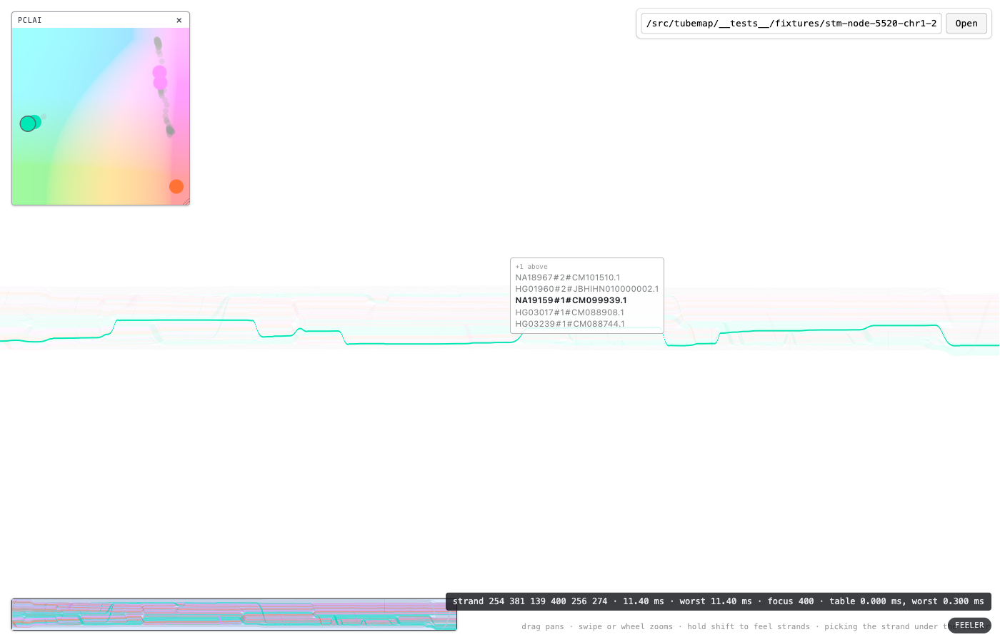

# The pick set in the ancestry cloud

**Date:** 2026-08-21. **Reproduce:** `npm run dev`, then

```
node scripts/verify_pick_set_cloud.mjs /src/tubemap/__tests__/fixtures/stm-node-5520-chr1-25331646-25335796.svg
```

Headed on purpose — headless chromium falls back to SwiftShader, where a readback is software
rasterization and the numbers say nothing about this one.

#120 made the pick answer with **every** strand inside the cursor's css pixel — six at fit on
`5520+` — and the label names all six. The PCLAI inset did not hear about it: it went on ringing
one dot and giving no sign the other five were under the cursor, which is the complaint #120 is
about, surviving in the last panel that had not heard it. Worse than merely incomplete, the two
readouts were then **two different counts of the same thing**, which is the failure mode
`CLAUDE.md` names outright — a researcher lost between representations.

This note records what the cloud does about it, and the four judgements inside that.

## Is the set worth showing at all?

The prior question, and it very nearly went the wrong way. If the strands sharing a css pixel of
map also share a placement, their dots land on top of each other under the ring, the tier shows
nothing, and it is dead weight somebody should delete.

**The first reading said exactly that, and it was wrong.** A probe of one parked row found all
seven dots within 3 px of each other, one saturated teal, and that looked conclusive. It was an
artefact of how the harness chose the row: it parked on the row with the most *placed* strands,
which selects almost precisely for the ancestry-coherent sets. Selection bias built into the
measuring instrument, and it produced a confident wrong answer from a real photograph.

Measured across the whole sweep instead — every row the feeler touched, widest gap between any
two of the set's placements, in plot pixels:

| | `5520+` at fit |
|---|---|
| rows placing two or more | 72 |
| widest gap, median | **191.3 px** |
| widest gap, p90 | 223.8 px |
| widest gap, max | 225.9 px |
| one blob — gap under a dot's width | **14 / 72** |
| scattered — gap over a quarter of the plot | **51 / 72** |

The plot is 216 px and its domain diagonal is about 260, so a median gap of 191 px means the
typical pick set spans most of the cloud. **Seven times in ten the strands sharing a css pixel
of map came from visibly different places in ancestry space.**

That is the reading the tier buys, and it is one the map cannot make on its own: *these six are
indistinguishable right here, and they are not the same kind of haplotype at all.* The other 19%
stack under the ring and the tier shows nothing — which costs nothing, and is the same
self-annulment the thickness floor and the sample count have.



## Three tiers, and why grey

| tier | what it is | how it is drawn |
|---|---|---|
| ringed | the strand the map has lit | `MARKED_SIZE`, full colour, grey hairline ring |
| in set | the rest of the pick set | `MARKED_SIZE`, full colour |
| the crowd | every other placed strand | `DOT_SIZE`, **28% opacity and desaturated** |

**Fading alone did not work, and the reason is structural.** A dot sits on the ramp's own
rendering of its coordinate — that is the whole design, it is what makes the ramp a legend — so
a *coloured* dot faded to 28% over the colour it already matches subtracts almost nothing. In
the dense arms the crowd stayed a saturated mass and the marked dots had to be hunted for inside
it. Draining the colour is what actually clears the ground: the arm goes grey, the ramp behind
it keeps its hue, and the marks are the only coloured things left in that part of the plot.

**Grey does not collide with anything in this plot**, which is what makes desaturation available
here and not in the map. `strandAppearance.ts` chose translucency over desaturation for the
bands precisely because grey already means `pclaiX="None"` there. In the cloud an unplaced
haplotype is never drawn at all — see `plotCloud` — so there is no grey dot for a desaturated
one to be confused with. It is the same argument the ring is already built on.

**Every mark is one size.** The set was briefly drawn smaller than the ringed dot, on the
reasoning that it is context rather than the answer. That was wrong: it makes size carry the
distinction the ring already carries, so the picture states it twice and the reader has to
compare diameters to learn what a hairline already says. One size, one ring, one meaning each.
`?setdot=`, which existed only to sweep that value, went with it.

## Absence

An unplaced strand is never marked, wherever it sits in the set, because absence must not be
drawn as a position. Three consequences, all deliberate and all tested:

- A set of six can legitimately put four dots on the plot. The **label** is what says six, and
  that is the division of labour: the label is a census, the cloud is a map.
- An unplaced *lit* strand rings nothing while its neighbours are still marked. Before this the
  cloud went blank in that case; now the rest of the set is still shown, which is strictly more
  than it could say before.
- A set that places nobody still recedes the crowd. The feeler is on something, and a cloud
  springing back to full colour would say it is not.

`5520+` leaves 99 of 464 strands unplaced, so a set of six carries about 1.3 of them on average.
This is adjacent to the deferred pgb #77 and does not resolve it.

## The label's swatches, and why the colour is not on the text

The other half of the association: each name in the feeler label carries a filled dot in that
strand's own colour — the same `strandCss` string the cloud paints its dot with — and the lit
row's swatch takes the cloud's own hairline ring. Reading a name and finding it in the cloud is
then matching one mark against another rather than holding a position in your head.

**Colouring the name text was the first proposal, and it is unusable.** Measured as WCAG
contrast against the label's white card, over every strand colour in both documents:

| ground | `5520+` (464 strands) | `stm-chr1-25331046-25331646` (369) |
|---|---|---|
| the label's white card | median **1.88:1**, best 2.74:1 | median 1.93:1, best 2.74:1 |
| reaching 4.5:1 (AA body text) | **0 of 464** | 0 of 369 |
| reaching 3:1 (AA large text) | **0 of 464** | 0 of 369 |
| a dark card, `#212529` | median 8.22:1, worst 5.63:1 | median 7.98:1, worst 5.63:1 |

The palette is pastel throughout, so not one colour in either document clears even the 3:1 that
large text asks for, and the unplaced grey `rgb(211, 211, 211)` lands at 1.5:1. Coloured names
would be a label nobody can read, against the legibility constraint this project treats as hard.

**A dark card would fix it** — every colour clears AA comfortably at 8:1 — and that is the
option left on the table rather than taken. It costs the deliberate match with PGB's node
tooltip that #111 established, and `surfaceStyles.ts` states plainly why that match is a design
constraint and not a convenience: a readout that changed medium between panels reads as a
different *kind* of object. Trading that for a colour the swatch already carries is not worth it.

So the colour is spent on a filled shape, where contrast is not the question, and the name stays
at the card's own near-black.

## What the harness checks, and what it cannot

`verify_pick_set_cloud.mjs` reads everything off the running surface — the set and the lit
strand from the `?pick` readout, the marks from the DOM the surface built — and confirms:

- the cloud marks exactly the placed members of the set the label names ✓
- every mark is the same width, read back and deduped rather than asserted ✓ (`20px`)
- releasing the feeler clears all three tiers ✓

Two bugs of its own, both found and fixed, both worth recording because they are the shape of
mistake this kind of harness makes:

- It read the cloud's DOM per row across a 260-row sweep with `Shift` held, and the synthetic
  key was dropped partway — so it recorded zero marks for a row the photograph pass then marked
  six times. It now takes the set from a plain hover (`?pick` runs the pass without the feeler)
  and gets the placed count from the parsed document, which cannot be dropped.
- The parking bias described above.

**What it does not check is the swatches**, and no photograph of them is committed. A synthetic
`Shift` gets dropped between arming the feeler and the shutter often enough that two attempts
photographed the map at rest instead. The swatch is covered by jsdom tests — every row carries
its own strand's colour, no row carries a `color` style, the name still round-trips
character-for-character — and was judged on screen by the user rather than from a picture here.
